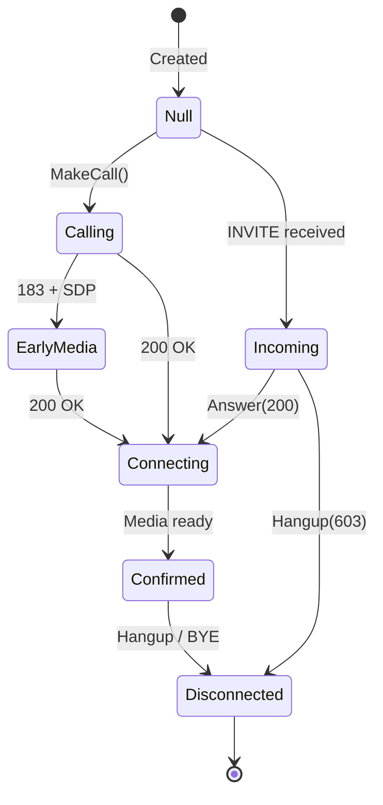
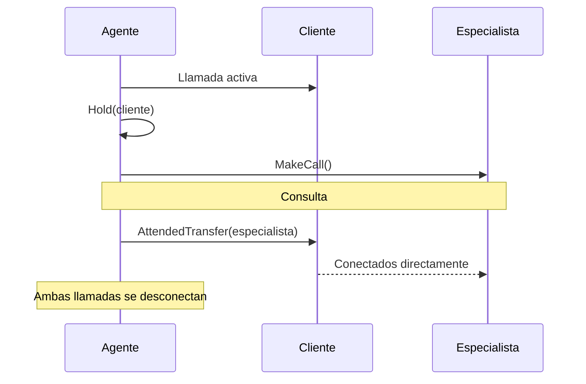

[English](README.md) | **[Español](README.es.md)**

<div align="center">

# ☎️ PjSip.Net

**SDK de alto nivel para telefonía SIP en .NET 10**

[](https://www.nuget.org/packages/PjSip.Net)
[](https://www.nuget.org/packages/PjSip.Net)
[](https://github.com/mchinchilla/PjSip.Net/actions/workflows/native-build.yml)
[](https://github.com/mchinchilla/PjSip.Net/actions/workflows/release.yml)
[](LICENSE.txt)
[](https://dotnet.microsoft.com/)

Basado en [PJSIP 2.16](https://www.pjsip.org/) con soporte TLS nativo (Schannel en Windows, OpenSSL en Android)
Compatible con **WinForms** · **WPF** · **MAUI** · **Mac Catalyst** · **Console**

</div>

---

### ✨ Características Principales

| | Característica | Descripción |
|---|---|---|
| 📞 | **Gestión de Llamadas** | Realizar, recibir, retener, transferir y grabar llamadas |
| 🔒 | **TLS Nativo** | Schannel (Windows), Secure Transport (macOS/iOS), OpenSSL (Android) |
| 👥 | **Presencia y BLF** | Monitorear disponibilidad de usuarios con SUBSCRIBE/NOTIFY |
| 🎙️ | **Control de Audio** | Selección de dispositivo, volumen, silencio, gestión de codecs (G.711, G.729, Opus, Speex, GSM, iLBC) |
| 🔀 | **Conferencia** | Puente de audio multi-participante con merge/split |
| 💬 | **Mensajería SIP** | Enviar y recibir mensajes de texto via SIP MESSAGE (RFC 3428) |
| 📊 | **Calidad de Llamada** | Estadísticas RTP en tiempo real, jitter, pérdida de paquetes, MOS score |
| 🌐 | **NAT Traversal** | Soporte integrado para STUN, ICE y TURN |
| 💉 | **Inyección de Dependencias** | Integración de primera clase con `IServiceCollection` |
| 📱 | **Multi-Plataforma** | Windows, macOS, Android, iOS desde una sola API |

---

## 📑 Tabla de Contenidos

- [Requisitos](#-requisitos)
- [Instalación](#-instalación)
- [Inicio Rápido](#-inicio-rápido)
- [Configuración](#️-configuración)
  - [SipPhoneOptions](#sipphoneoptions)
  - [SipAccountOptions](#sipaccountoptions)
  - [Transporte y TLS](#-transporte-y-tls)
  - [NAT/STUN/ICE/TURN](#-natstuniceurn)
- [Inyección de Dependencias](#-inyección-de-dependencias)
- [API Reference](#-api-reference)
  - [ISipPhone](#isipphone)
  - [ISipAccount](#isipaccount)
  - [ISipCall](#isipcall)
  - [ISipAudioManager](#isipaudiomanager)
  - [ISipCodecManager](#isipcodecmanager)
  - [ISipPresenceManager](#isippresencemanager)
  - [ISipMessaging](#isipmessaging)
  - [ISipConferenceBridge](#isipconferencebridge)
  - [ISipCallRecorder](#isipcallrecorder)
  - [ISipToneGenerator](#isiptonegenerator)
  - [ISipCallQualityMonitor](#isipcallqualitymonitor)
  - [ISipCallHistory](#isipcallhistory)
  - [ISipNetworkMonitor](#isipnetworkmonitor)
- [Eventos](#-eventos)
- [Features Avanzados](#-features-avanzados)
- [Ejemplos por Plataforma](#-ejemplos-por-plataforma)
- [Manejo de Errores](#-manejo-de-errores)
- [Audio](#-audio)
- [Acceso Low-Level (pjsua2)](#-acceso-low-level-pjsua2)
- [Arquitectura](#️-arquitectura)
- [Plataformas Soportadas](#-plataformas-soportadas)
- [Build desde Código Fuente](#️-build-desde-código-fuente)

---

## 📋 Requisitos

- **.NET 10** SDK o superior
- **Paquete nativo** correspondiente a tu plataforma (se instala automáticamente via NuGet)

## 📦 Instalación

```bash
# SDK principal (obligatorio)
dotnet add package PjSip.Net

# Binarios nativos — instala el de tu plataforma objetivo
dotnet add package PjSip.Net.Native.Win64        # Windows x64
dotnet add package PjSip.Net.Native.MacOS         # macOS x64 / arm64
dotnet add package PjSip.Net.Native.Android       # Android arm64
dotnet add package PjSip.Net.Native.iOS           # iOS arm64
```

> **Nota:** El paquete nativo contiene el binario compilado de `pjsua2` y se copia automáticamente al directorio de salida.

---

## 🚀 Inicio Rápido

```csharp
using Microsoft.Extensions.DependencyInjection;
using PjSip.Net;
using PjSip.Net.Accounts;
using PjSip.Net.DependencyInjection;
using PjSip.Net.Transport;

// 1. Configurar servicios
var services = new ServiceCollection();
services.AddLogging();
services.AddPjSip(options =>
{
    options.Transports.Add(new SipTransportOptions
    {
        Type = SipTransportType.Udp,
        Port = 5060
    });
    options.Accounts.Add(new SipAccountOptions
    {
        Username = "1001",
        Password = "secret",
        Domain = "pbx.miempresa.com",
        Registrar = "sip:pbx.miempresa.com"
    });
});

// 2. Resolver y arrancar
var provider = services.BuildServiceProvider();
var phone = provider.GetRequiredService<ISipPhone>();

phone.IncomingCall += (s, e) =>
{
    Console.WriteLine($"Llamada entrante de {e.RemoteUri}");
    e.Call.Answer();  // Contestar automáticamente
};

phone.CallStateChanged += (s, e) =>
    Console.WriteLine($"Llamada {e.Call.Id}: {e.OldState} -> {e.NewState}");

await phone.StartAsync();

// 3. Realizar una llamada
var call = phone.MakeCall(phone.Accounts[0], "sip:1002@pbx.miempresa.com");

// 4. Colgar
call.Hangup();

// 5. Apagar limpiamente
await phone.StopAsync();
```

---

## ⚙️ Configuración

### SipPhoneOptions

Opciones globales del endpoint SIP. Se configuran al registrar el servicio.

```csharp
services.AddPjSip(options =>
{
    options.UserAgent = "MiApp/2.0";        // User-Agent en headers SIP (default: "PjSip.Net/1.0")
    options.LogLevel = 4;                    // Nivel de log PJSIP: 0=fatal, 5=trace (default: 4)
    options.MaxCalls = 8;                    // Máximo de llamadas simultáneas (default: 4)
    options.UseCompactForm = false;          // Headers SIP compactos (default: false)
    options.CallHistoryMaxEntries = 1000;    // Máximo de entradas en historial (default: 1000)
    options.Transports = [ ... ];            // Lista de transportes a crear
    options.Accounts = [ ... ];             // Cuentas a registrar al iniciar
    options.Nat = new NatOptions { ... };   // Configuración NAT/STUN/ICE/TURN
});
```

| Propiedad | Tipo | Default | Descripción |
|---|---|---|---|
| `UserAgent` | `string` | `"PjSip.Net/1.0"` | Valor del header User-Agent en mensajes SIP |
| `LogLevel` | `int` | `4` | Verbosidad del log interno de PJSIP (0-5) |
| `MaxCalls` | `int` | `4` | Número máximo de llamadas simultáneas |
| `UseCompactForm` | `bool` | `false` | Usar headers SIP en forma compacta |
| `CallHistoryMaxEntries` | `int` | `1000` | Máximo de entradas almacenadas en el historial de llamadas |
| `Transports` | `List<SipTransportOptions>` | `[]` | Transportes SIP a crear al iniciar |
| `Accounts` | `List<SipAccountOptions>` | `[]` | Cuentas SIP a registrar automáticamente |
| `Nat` | `NatOptions` | `new()` | Configuración de NAT traversal (STUN/ICE/TURN) |

### SipAccountOptions

Configuración de una cuenta SIP individual.

```csharp
new SipAccountOptions
{
    Username = "1001",                       // Usuario SIP (obligatorio)
    Password = "secret",                     // Contraseña (obligatorio)
    Domain = "pbx.miempresa.com",           // Dominio SIP (obligatorio)
    Registrar = "sip:pbx.miempresa.com",    // URI del registrar (null = usa Domain)
    OutboundProxy = "sip:proxy.miempresa.com", // Proxy de salida (null = ninguno)
    DisplayName = "Juan Pérez",             // Nombre para mostrar en caller ID
    Realm = "*",                             // Realm de autenticación (null = automático)
    RegistrationTimeout = 300,               // Expiración del registro en segundos (default: 300)
    RegisterOnAdd = true,                    // Registrar automáticamente al agregar (default: true)
    UseTls = false                           // Agregar ;transport=tls a URIs de registrar/proxy (default: false)
}
```

| Propiedad | Tipo | Default | Descripción |
|---|---|---|---|
| `Username` | `string` | *requerido* | Usuario SIP para autenticación |
| `Password` | `string` | *requerido* | Contraseña de la cuenta |
| `Domain` | `string` | *requerido* | Dominio/servidor SIP |
| `Registrar` | `string?` | `null` | URI completa del registrar. Si es `null`, se construye desde `Domain` |
| `OutboundProxy` | `string?` | `null` | URI del proxy SIP de salida. El esquema (`sip:`/`sips:`) se agrega automáticamente si falta |
| `DisplayName` | `string?` | `null` | Nombre visible en el Caller ID |
| `Realm` | `string?` | `null` | Realm para digest auth. `null` = acepta cualquier challenge |
| `RegistrationTimeout` | `int` | `300` | Tiempo de expiración del REGISTER en segundos |
| `RegisterOnAdd` | `bool` | `true` | Si `true`, envía REGISTER automáticamente al agregar la cuenta |
| `UseTls` | `bool` | `false` | Agrega `;transport=tls` a las URIs del registrar y proxy |

### 🔐 Transporte y TLS

```csharp
// UDP (sin cifrar)
options.Transports.Add(new SipTransportOptions
{
    Type = SipTransportType.Udp,
    Port = 5060
});

// TCP
options.Transports.Add(new SipTransportOptions
{
    Type = SipTransportType.Tcp,
    Port = 5060
});

// TLS (cifrado) — Usa Schannel en Windows, sin dependencia de OpenSSL
options.Transports.Add(new SipTransportOptions
{
    Type = SipTransportType.Tls,
    Port = 5061,
    Tls = new TlsOptions
    {
        VerifyServer = true,               // Validar certificado del servidor (default: true)
        VerifyClient = false,              // Requiere certificado del cliente (default: false)
        CertificateFile = null,            // Ruta al certificado del cliente (.pem)
        PrivateKeyFile = null,             // Ruta a la clave privada del cliente (.pem)
        CaListFile = null                  // Ruta a CAs de confianza adicionales (.pem)
    }
});

// IPv6
options.Transports.Add(new SipTransportOptions
{
    Type = SipTransportType.Tls6,          // TLS sobre IPv6
    Port = 5061
});
```

**Tipos de transporte disponibles:**

| Enum | Protocolo | Puerto Estándar |
|---|---|---|
| `SipTransportType.Udp` | UDP/IPv4 | 5060 |
| `SipTransportType.Tcp` | TCP/IPv4 | 5060 |
| `SipTransportType.Tls` | TLS/IPv4 | 5061 |
| `SipTransportType.Udp6` | UDP/IPv6 | 5060 |
| `SipTransportType.Tcp6` | TCP/IPv6 | 5060 |
| `SipTransportType.Tls6` | TLS/IPv6 | 5061 |

**TlsOptions:**

| Propiedad | Tipo | Default | Descripción |
|---|---|---|---|
| `VerifyServer` | `bool` | `true` | Validar el certificado TLS del servidor |
| `VerifyClient` | `bool` | `false` | Requerir certificado TLS del cliente |
| `CertificateFile` | `string?` | `null` | Ruta al certificado del cliente (formato PEM) |
| `PrivateKeyFile` | `string?` | `null` | Ruta a la clave privada del cliente (formato PEM) |
| `CaListFile` | `string?` | `null` | Ruta a la lista de CAs de confianza adicionales |

> **Windows:** TLS usa Schannel (nativo del OS). No necesitas instalar OpenSSL.
> **macOS/iOS:** Usa Secure Transport del sistema.
> **Android:** TLS habilitado vía OpenSSL 3.4.1 (enlazado estáticamente).

### 🌐 NAT/STUN/ICE/TURN

Configuración de NAT traversal para redes detrás de firewalls o routers NAT.

```csharp
options.Nat = new NatOptions
{
    EnableStun = true,
    StunServers = ["stun.l.google.com:19302", "stun1.l.google.com:19302"],
    EnableIce = true,                        // ICE para media NAT traversal (default: true)
    EnableTurn = false,                      // TURN relay (para NAT simétricos)
    TurnServer = "turn.miempresa.com:3478",
    TurnUsername = "user",
    TurnPassword = "pass",
    TurnTransport = NatTraversalType.Udp,   // Transporte TURN: Udp, Tcp, Tls
    IceAggressiveNomination = false          // Nominación agresiva ICE
};
```

| Propiedad | Tipo | Default | Descripción |
|---|---|---|---|
| `EnableStun` | `bool` | `false` | Activar resolución STUN para descubrir IP pública |
| `StunServers` | `List<string>` | `[]` | Lista de servidores STUN (`host:port`) |
| `EnableIce` | `bool` | `true` | Activar ICE para NAT traversal del media |
| `EnableTurn` | `bool` | `false` | Activar TURN relay para NAT simétricos |
| `TurnServer` | `string?` | `null` | Dirección del servidor TURN (`host:port`) |
| `TurnUsername` | `string?` | `null` | Usuario para autenticación TURN |
| `TurnPassword` | `string?` | `null` | Contraseña para autenticación TURN |
| `TurnTransport` | `NatTraversalType` | `Udp` | Transporte TURN: `Udp`, `Tcp`, `Tls` |
| `IceAggressiveNomination` | `bool` | `false` | Nominación agresiva ICE (más rápido, menos confiable) |

---

## 💉 Inyección de Dependencias

### Registro básico (Singleton)

```csharp
services.AddPjSip(options =>
{
    options.Transports.Add(new SipTransportOptions { Type = SipTransportType.Udp });
    options.Accounts.Add(new SipAccountOptions
    {
        Username = "1001",
        Password = "secret",
        Domain = "pbx.miempresa.com"
    });
});
```

### Registro con lifetime explícito

```csharp
using PjSip.Net.DependencyInjection;

// Singleton (default) — una instancia para toda la aplicación
services.AddPjSip(options => { ... }, PjSipServiceLifetime.Singleton);

// Scoped — una instancia por scope (útil en aplicaciones web)
services.AddPjSip(options => { ... }, PjSipServiceLifetime.Scoped);
```

### Servicios registrados

`AddPjSip` registra automáticamente:

| Servicio | Descripción |
|---|---|
| `ISipPhone` | Facade principal — gestión de cuentas, llamadas y transporte |
| `ISipAudioManager` | Gestión de dispositivos de audio (micrófono, altavoz, volumen) |
| `ISipCodecManager` | Gestión de codecs de audio (prioridades, habilitar/deshabilitar) |
| `ISipPresenceManager` | Presencia y BLF (Busy Lamp Field) |
| `ISipMessaging` | Mensajería SIP (SIP MESSAGE) |
| `ISipConferenceBridge` | Conferencia de audio (puente) |
| `ISipCallRecorder` | Grabación de llamadas |
| `ISipToneGenerator` | Generador de tonos (ringback, busy, dial, DTMF) |
| `ISipCallQualityMonitor` | Monitoreo de calidad de llamada (RTP stats, MOS) |
| `ISipCallHistory` | Historial de llamadas |
| `ISipNetworkMonitor` | Monitoreo de cambios de red |

### Inyectar en tus clases

```csharp
public class MiServicioTelefonia
{
    private readonly ISipPhone _phone;

    public MiServicioTelefonia(ISipPhone phone)
    {
        _phone = phone;
        _phone.IncomingCall += OnIncomingCall;
    }

    public async Task IniciarAsync()
    {
        await _phone.StartAsync();
    }

    public ISipCall Llamar(string destino)
    {
        return _phone.MakeCall(_phone.Accounts[0], destino);
    }

    private void OnIncomingCall(object? sender, IncomingCallEventArgs e)
    {
        // Lógica para llamadas entrantes
    }
}
```

También puedes inyectar sub-managers directamente:

```csharp
public class MiServicioPresencia
{
    private readonly ISipPresenceManager _presence;
    private readonly ISipCallHistory _history;

    public MiServicioPresencia(ISipPresenceManager presence, ISipCallHistory history)
    {
        _presence = presence;
        _history = history;
    }

    public async Task MostrarDisponibleAsync()
    {
        await _presence.SetMyPresenceAsync(BuddyState.Online, "Disponible");
    }

    public int LlamadasPerdidasHoy()
    {
        return _history.GetMissedCalls().Count;
    }
}
```

---

## 📖 API Reference

### ISipPhone

Facade principal del SDK. Gestiona el ciclo de vida del endpoint SIP, cuentas, llamadas y todos los sub-managers.

```csharp
public interface ISipPhone : IAsyncDisposable, IDisposable
```

**Propiedades:**

| Propiedad | Tipo | Descripción |
|---|---|---|
| `State` | `SipPhoneState` | Estado actual del teléfono |
| `Accounts` | `IReadOnlyList<ISipAccount>` | Cuentas SIP registradas |
| `Audio` | `ISipAudioManager` | Gestor de dispositivos de audio |
| `Codecs` | `ISipCodecManager` | Gestor de codecs de audio |
| `Presence` | `ISipPresenceManager` | Gestor de presencia y BLF |
| `Messaging` | `ISipMessaging` | Mensajería SIP (MESSAGE) |
| `Conference` | `ISipConferenceBridge` | Puente de conferencia |
| `Recorder` | `ISipCallRecorder` | Grabador de llamadas |
| `Tones` | `ISipToneGenerator` | Generador de tonos |
| `Quality` | `ISipCallQualityMonitor` | Monitor de calidad de llamada |
| `History` | `ISipCallHistory` | Historial de llamadas |
| `Network` | `ISipNetworkMonitor` | Monitor de cambios de red |

**Métodos:**

| Método | Retorno | Descripción |
|---|---|---|
| `StartAsync(ct)` | `Task` | Inicializa PJSIP, crea transportes y registra cuentas configuradas |
| `StopAsync(ct)` | `Task` | Cuelga todas las llamadas, des-registra cuentas y destruye el endpoint |
| `AddAccount(options)` | `ISipAccount` | Agrega una nueva cuenta SIP en runtime |
| `RemoveAccount(account)` | `void` | Elimina y des-registra una cuenta |
| `MakeCall(account, uri)` | `ISipCall` | Inicia una llamada saliente desde una cuenta |
| `MakeCall(account, uri, headers)` | `ISipCall` | Inicia una llamada saliente con headers SIP custom |

**Eventos:**

| Evento | EventArgs | Descripción |
|---|---|---|
| `IncomingCall` | `IncomingCallEventArgs` | Llamada entrante en cualquier cuenta |
| `CallStateChanged` | `CallStateChangedEventArgs` | Cambio de estado en cualquier llamada |
| `RegistrationStateChanged` | `RegistrationStateChangedEventArgs` | Cambio de registro en cualquier cuenta |
| `TransportStateChanged` | `TransportStateChangedEventArgs` | Cambio de estado del transporte |
| `MwiStateChanged` | `MwiStateChangedEventArgs` | Nuevo indicador de mensaje en espera (voicemail) |

**Estados (`SipPhoneState`):**

| Estado | Descripción |
|---|---|
| `Idle` | Recién creado, no inicializado |
| `Starting` | Inicializando el endpoint PJSIP |
| `Running` | Operativo — puede hacer y recibir llamadas |
| `Stopping` | Apagándose |
| `Stopped` | Apagado limpiamente |
| `Error` | Error durante inicio o parada |

---

### ISipAccount

Representa una cuenta SIP con la que se pueden enviar/recibir llamadas.

```csharp
public interface ISipAccount : IDisposable
```

**Propiedades:**

| Propiedad | Tipo | Descripción |
|---|---|---|
| `Id` | `string` | Identificador único de la cuenta |
| `Uri` | `string` | URI SIP de la cuenta (ej: `sip:1001@pbx.com`) |
| `RegistrationState` | `SipRegistrationState` | Estado de registro actual |
| `Options` | `SipAccountOptions` | Configuración de la cuenta |
| `ActiveCalls` | `IReadOnlyList<ISipCall>` | Llamadas activas en esta cuenta |
| `DndMode` | `DndMode` | Modo Do Not Disturb (lectura/escritura) |
| `CallForwarding` | `CallForwardingOptions` | Configuración de desvío de llamadas |
| `MwiInfo` | `MwiInfo?` | Información de mensajes en espera (voicemail), `null` si no hay datos |

**Métodos:**

| Método | Retorno | Descripción |
|---|---|---|
| `RegisterAsync(ct)` | `Task` | Envía REGISTER al servidor |
| `UnregisterAsync(ct)` | `Task` | Envía un-REGISTER al servidor |
| `MakeCall(destinationUri)` | `ISipCall` | Inicia una llamada desde esta cuenta |
| `MakeCall(destinationUri, headers)` | `ISipCall` | Inicia una llamada con headers SIP custom |

**Eventos:**

| Evento | EventArgs | Descripción |
|---|---|---|
| `RegistrationStateChanged` | `RegistrationStateChangedEventArgs` | Cambio de estado de registro |
| `IncomingCall` | `IncomingCallEventArgs` | Llamada entrante para esta cuenta |
| `MwiStateChanged` | `MwiStateChangedEventArgs` | Nuevo estado de voicemail |

**Estados de registro (`SipRegistrationState`):**

| Estado | Descripción |
|---|---|
| `Unregistered` | No registrado |
| `Registering` | REGISTER enviado, esperando respuesta |
| `Registered` | Registrado exitosamente (200 OK) |
| `Unregistering` | Un-REGISTER enviado |
| `Error` | Error en el registro (401, 403, timeout, etc.) |

---

### ISipCall

Representa una llamada SIP activa (entrante o saliente).

```csharp
public interface ISipCall : IDisposable
```

**Propiedades:**

| Propiedad | Tipo | Descripción |
|---|---|---|
| `Id` | `string` | Identificador único de la llamada |
| `State` | `SipCallState` | Estado actual de la llamada |
| `Direction` | `CallDirection` | `Incoming` o `Outgoing` |
| `Info` | `SipCallInfo` | Información detallada (URIs, duración, status code) |
| `CustomHeaders` | `IReadOnlyList<SipHeader>` | Headers SIP personalizados de la llamada |
| `IsMuted` | `bool` | Si el micrófono está silenciado en esta llamada |
| `IsOnHold` | `bool` | Si la llamada está en espera |

**Métodos:**

| Método | Descripción |
|---|---|
| `Answer(statusCode)` | Contestar la llamada. Default: `200` (OK) |
| `Answer(statusCode, headers)` | Contestar con headers SIP custom |
| `Hangup(statusCode)` | Colgar la llamada. Default: `603` (Decline) |
| `Hold()` | Poner en espera (hold) |
| `Unhold()` | Quitar de espera (re-INVITE) |
| `Transfer(destinationUri)` | Transferir la llamada a otro destino (REFER) |
| `AttendedTransfer(targetCall)` | Transferencia atendida — conecta esta llamada con otra activa |
| `SendDtmf(digits)` | Enviar tonos DTMF (ej: `"1234#"`) |
| `SetMute(mute)` | Silenciar/des-silenciar el micrófono |

**Códigos de respuesta comunes para `Answer()`:**

| Código | Significado |
|---|---|
| `180` | Ringing (sin contestar, solo señalizar ring) |
| `200` | OK — contestar la llamada |
| `486` | Busy Here — rechazar como ocupado |
| `603` | Decline — rechazar la llamada |

**Estados de llamada (`SipCallState`):**



| Estado | Descripción |
|---|---|
| `Null` | Llamada recién creada |
| `Calling` | INVITE enviado, esperando respuesta |
| `Incoming` | INVITE recibido, sin contestar |
| `EarlyMedia` | Recibiendo early media (183 + SDP) |
| `Connecting` | Respuesta 2xx recibida, estableciendo media |
| `Confirmed` | Llamada activa con audio bidireccional |
| `Disconnected` | Llamada terminada |

**SipCallInfo (información de la llamada):**

| Propiedad | Tipo | Descripción |
|---|---|---|
| `CallId` | `string` | Call-ID del header SIP |
| `RemoteUri` | `string` | URI del otro extremo |
| `LocalUri` | `string` | URI local |
| `State` | `SipCallState` | Estado actual |
| `Direction` | `CallDirection` | Dirección de la llamada |
| `Duration` | `TimeSpan` | Duración de la llamada |
| `RemoteDisplayName` | `string?` | Nombre del llamante remoto |
| `StatusCode` | `int` | Último código SIP recibido |
| `StatusText` | `string?` | Texto del último status SIP |

**SipHeader (header personalizado):**

```csharp
public sealed record SipHeader
{
    public required string Name { get; init; }
    public required string Value { get; init; }
}
```

---

### ISipAudioManager

Gestión de dispositivos de audio y volumen.

```csharp
public interface ISipAudioManager
```

**Propiedades:**

| Propiedad | Tipo | Descripción |
|---|---|---|
| `CurrentInputDevice` | `AudioDeviceInfo?` | Micrófono activo actual |
| `CurrentOutputDevice` | `AudioDeviceInfo?` | Altavoz/auricular activo actual |
| `InputLevel` | `float` | Nivel de volumen de entrada (0.0 — 1.0) |
| `OutputLevel` | `float` | Nivel de volumen de salida (0.0 — 1.0) |

**Métodos:**

| Método | Retorno | Descripción |
|---|---|---|
| `GetInputDevices()` | `IReadOnlyList<AudioDeviceInfo>` | Lista de micrófonos disponibles |
| `GetOutputDevices()` | `IReadOnlyList<AudioDeviceInfo>` | Lista de altavoces disponibles |
| `SetInputDevice(deviceId)` | `void` | Cambiar el micrófono activo |
| `SetOutputDevice(deviceId)` | `void` | Cambiar el altavoz activo |

**AudioDeviceInfo:**

| Propiedad | Tipo | Descripción |
|---|---|---|
| `DeviceId` | `int` | ID del dispositivo |
| `Name` | `string` | Nombre del dispositivo (ej: "Realtek HD Audio") |
| `InputChannels` | `int` | Número de canales de entrada |
| `OutputChannels` | `int` | Número de canales de salida |
| `Driver` | `string?` | Nombre del driver de audio |

---

### ISipCodecManager

Gestión de codecs de audio: listar, priorizar, habilitar y deshabilitar.

```csharp
public interface ISipCodecManager
```

**Métodos:**

| Método | Retorno | Descripción |
|---|---|---|
| `GetCodecs()` | `IReadOnlyList<CodecInfo>` | Lista de codecs disponibles con sus prioridades |
| `SetCodecPriority(codecId, priority)` | `void` | Establecer prioridad de un codec (0-255, 0 = deshabilitado) |
| `EnableCodec(codecId, priority)` | `void` | Habilitar un codec con prioridad opcional (default: 128) |
| `DisableCodec(codecId)` | `void` | Deshabilitar un codec (prioridad = 0) |

**CodecInfo:**

| Propiedad | Tipo | Descripción |
|---|---|---|
| `CodecId` | `string` | Identificador del codec (ej: `"PCMU/8000"`, `"opus/48000"`, `"G729/8000"`) |
| `Description` | `string` | Descripción legible del codec |
| `Priority` | `int` | Prioridad actual (0-255, 0 = deshabilitado) |
| `ClockRate` | `int` | Frecuencia de muestreo en Hz |
| `ChannelCount` | `int` | Número de canales de audio |

---

### ISipPresenceManager

Gestión de presencia (SUBSCRIBE/NOTIFY) y BLF (Busy Lamp Field).

```csharp
public interface ISipPresenceManager
```

**Propiedades:**

| Propiedad | Tipo | Descripción |
|---|---|---|
| `Buddies` | `IReadOnlyList<ISipBuddy>` | Lista de buddies monitoreados |
| `MyState` | `BuddyState` | Mi estado de presencia actual |

**Métodos:**

| Método | Retorno | Descripción |
|---|---|---|
| `AddBuddy(uri)` | `ISipBuddy` | Agregar un buddy para monitorear su presencia |
| `RemoveBuddy(buddy)` | `void` | Dejar de monitorear un buddy |
| `SetMyPresenceAsync(state, statusText, ct)` | `Task` | Publicar mi estado de presencia |

**Eventos:**

| Evento | EventArgs | Descripción |
|---|---|---|
| `BuddyStateChanged` | `BuddyStateChangedEventArgs` | Cambio de estado de un buddy |

**ISipBuddy:**

| Propiedad/Método | Tipo | Descripción |
|---|---|---|
| `Uri` | `string` | URI SIP del buddy |
| `State` | `BuddyState` | Estado actual |
| `Info` | `BuddyInfo` | Información completa (nombre, estado, texto, timestamp) |
| `StateChanged` | `event` | Notificación de cambio de estado |
| `SubscribeAsync(ct)` | `Task` | Suscribirse a las notificaciones de presencia |
| `UnsubscribeAsync(ct)` | `Task` | Cancelar la suscripción |

**BuddyState:**

| Estado | Descripción |
|---|---|
| `Unknown` | Estado desconocido |
| `Online` | Disponible |
| `Away` | Ausente |
| `Busy` | Ocupado |
| `OnThePhone` | En una llamada |
| `Offline` | Fuera de línea |

---

### ISipMessaging

Envío y recepción de mensajes SIP (método MESSAGE, RFC 3428).

```csharp
public interface ISipMessaging
```

**Métodos:**

| Método | Retorno | Descripción |
|---|---|---|
| `SendMessageAsync(account, destUri, body, contentType, ct)` | `Task` | Enviar un mensaje SIP. `contentType` default: `"text/plain"` |

**Eventos:**

| Evento | EventArgs | Descripción |
|---|---|---|
| `MessageReceived` | `SipMessageReceivedEventArgs` | Mensaje recibido (contiene `SipMessage`) |
| `MessageStatus` | `SipMessageStatusEventArgs` | Status de entrega de un mensaje enviado |

**SipMessage:**

| Propiedad | Tipo | Descripción |
|---|---|---|
| `From` | `string` | URI del remitente |
| `To` | `string` | URI del destinatario |
| `Body` | `string` | Cuerpo del mensaje |
| `ContentType` | `string` | Tipo de contenido (default: `"text/plain"`) |
| `Timestamp` | `DateTime` | Hora del mensaje (UTC) |

---

### ISipConferenceBridge

Puente de conferencia para mezclar audio de múltiples llamadas.

```csharp
public interface ISipConferenceBridge
```

**Propiedades:**

| Propiedad | Tipo | Descripción |
|---|---|---|
| `Participants` | `IReadOnlyList<ISipCall>` | Llamadas actualmente en la conferencia |

**Métodos:**

| Método | Retorno | Descripción |
|---|---|---|
| `AddParticipant(call)` | `void` | Agregar una llamada a la conferencia |
| `RemoveParticipant(call)` | `void` | Remover una llamada de la conferencia |
| `MergeAll(calls)` | `void` | Unir varias llamadas en una sola conferencia |
| `SplitAll()` | `void` | Separar todas las llamadas de la conferencia |

---

### ISipCallRecorder

Grabación de llamadas a archivo.

```csharp
public interface ISipCallRecorder : IDisposable
```

**Propiedades:**

| Propiedad | Tipo | Descripción |
|---|---|---|
| `IsRecording` | `bool` | Si hay una grabación en curso |
| `CurrentFilePath` | `string?` | Ruta del archivo actual, `null` si no está grabando |

**Métodos:**

| Método | Retorno | Descripción |
|---|---|---|
| `StartRecording(call, filePath, format)` | `void` | Iniciar grabación. `format` default: `Wav` |
| `StopRecording()` | `void` | Detener la grabación actual |

**Eventos:**

| Evento | EventArgs | Descripción |
|---|---|---|
| `RecordingStateChanged` | `RecordingStateChangedEventArgs` | Cambio de estado de la grabación |

**RecordingFormat:**

| Valor | Descripción |
|---|---|
| `Wav` | Formato WAV sin comprimir |

---

### ISipToneGenerator

Generador de tonos de señalización.

```csharp
public interface ISipToneGenerator : IDisposable
```

**Propiedades:**

| Propiedad | Tipo | Descripción |
|---|---|---|
| `IsPlaying` | `bool` | Si hay un tono reproduciéndose |

**Métodos:**

| Método | Retorno | Descripción |
|---|---|---|
| `PlayTone(tone)` | `void` | Reproducir un tipo de tono predefinido |
| `PlayTones(tones)` | `void` | Reproducir una secuencia de tonos custom |
| `PlayRingbackTone()` | `void` | Tono de ringback (North American: 440+480 Hz) |
| `PlayBusyTone()` | `void` | Tono de ocupado (480+620 Hz) |
| `PlayDialTone()` | `void` | Tono de marcado (350+440 Hz) |
| `Stop()` | `void` | Detener el tono actual |

**ToneDescriptor (para tonos custom):**

| Propiedad | Tipo | Descripción |
|---|---|---|
| `Frequency1` | `int` | Primera frecuencia en Hz |
| `Frequency2` | `int` | Segunda frecuencia en Hz (0 = tono simple) |
| `OnMs` | `int` | Duración del tono en milisegundos |
| `OffMs` | `int` | Duración del silencio en milisegundos |
| `Volume` | `int` | Volumen (default: 16000) |

**ToneType:**

| Valor | Descripción |
|---|---|
| `Ringback` | Tono de ringback estándar |
| `Busy` | Tono de ocupado |
| `Dial` | Tono de marcado |
| `Custom` | Tono personalizado |

---

### ISipCallQualityMonitor

Monitoreo de calidad de llamada: estadísticas RTP, jitter, pérdida de paquetes y MOS score.

```csharp
public interface ISipCallQualityMonitor
```

**Métodos:**

| Método | Retorno | Descripción |
|---|---|---|
| `GetQuality(call)` | `CallQualityInfo?` | Obtener calidad actual de una llamada (síncrono) |
| `GetQualityAsync(call, ct)` | `Task<CallQualityInfo?>` | Obtener calidad actual (asíncrono, thread-safe) |

**Eventos:**

| Evento | EventArgs | Descripción |
|---|---|---|
| `QualityReportAvailable` | `CallQualityEventArgs` | Reporte de calidad disponible |

**CallQualityInfo:**

| Propiedad | Tipo | Descripción |
|---|---|---|
| `CallId` | `string` | ID de la llamada |
| `Duration` | `TimeSpan` | Duración de la llamada al momento de la medición |
| `RtpPacketsSent` | `long` | Total de paquetes RTP enviados |
| `RtpPacketsReceived` | `long` | Total de paquetes RTP recibidos |
| `RtpPacketsLost` | `long` | Paquetes RTP perdidos |
| `RtpLossPercentage` | `double` | Porcentaje de pérdida de paquetes |
| `RtpJitterMs` | `int` | Jitter en milisegundos |
| `RtpRoundTripTimeMs` | `int` | Round-trip time en milisegundos |
| `CodecName` | `string?` | Codec activo en la llamada |
| `CodecClockRate` | `int` | Clock rate del codec activo |
| `MosScore` | `double` | Mean Opinion Score estimado (1.0 — 5.0) |

---

### ISipCallHistory

Historial de llamadas con filtrado por tipo.

```csharp
public interface ISipCallHistory
```

**Propiedades:**

| Propiedad | Tipo | Descripción |
|---|---|---|
| `Entries` | `IReadOnlyList<CallHistoryEntry>` | Todas las entradas del historial |

**Métodos:**

| Método | Retorno | Descripción |
|---|---|---|
| `GetMissedCalls()` | `IReadOnlyList<CallHistoryEntry>` | Llamadas entrantes no contestadas |
| `GetIncomingCalls()` | `IReadOnlyList<CallHistoryEntry>` | Todas las llamadas entrantes |
| `GetOutgoingCalls()` | `IReadOnlyList<CallHistoryEntry>` | Todas las llamadas salientes |
| `Clear()` | `void` | Limpiar el historial |

**Eventos:**

| Evento | EventArgs | Descripción |
|---|---|---|
| `EntryAdded` | `CallHistoryEntry` | Nueva entrada agregada al historial |

**CallHistoryEntry:**

| Propiedad | Tipo | Descripción |
|---|---|---|
| `CallId` | `string` | ID de la llamada |
| `RemoteUri` | `string` | URI del otro extremo |
| `RemoteDisplayName` | `string?` | Nombre del otro extremo |
| `Direction` | `CallDirection` | `Incoming` o `Outgoing` |
| `StartTime` | `DateTime` | Hora de inicio |
| `EndTime` | `DateTime?` | Hora de finalización |
| `Duration` | `TimeSpan` | Duración de la llamada |
| `FinalState` | `SipCallState` | Estado final de la llamada |
| `StatusCode` | `int` | Código SIP final |
| `AccountUri` | `string?` | URI de la cuenta local |

---

### ISipNetworkMonitor

Monitoreo de cambios de red para re-registrar cuentas automáticamente.

```csharp
public interface ISipNetworkMonitor : IDisposable
```

**Propiedades:**

| Propiedad | Tipo | Descripción |
|---|---|---|
| `CurrentState` | `NetworkState` | Estado actual de la red |

**Métodos:**

| Método | Retorno | Descripción |
|---|---|---|
| `HandleNetworkChangeAsync(ct)` | `Task` | Notificar un cambio de red manualmente (re-registra cuentas, reinicia transportes) |

**Eventos:**

| Evento | EventArgs | Descripción |
|---|---|---|
| `NetworkStateChanged` | `NetworkStateChangedEventArgs` | Cambio de estado de la red |

**NetworkState:**

| Estado | Descripción |
|---|---|
| `Connected` | Red conectada |
| `Disconnected` | Sin conectividad de red |
| `Changed` | La red cambió (nueva IP, cambio WiFi/datos) |

---

## 🔔 Eventos

Todos los eventos se disparan en el hilo que procesó el callback de PJSIP. En aplicaciones UI (WinForms/WPF/MAUI), usa el dispatcher correspondiente para actualizar la interfaz.

### En ISipPhone (nivel global)

```csharp
// Llamada entrante en cualquier cuenta
phone.IncomingCall += (sender, e) =>
{
    Console.WriteLine($"Llamada de {e.RemoteDisplayName} <{e.RemoteUri}>");
    Console.WriteLine($"Cuenta destino: {e.Account.Uri}");

    e.Call.Answer();           // Contestar
    // o: e.Call.Hangup(486);  // Rechazar como ocupado
};

// Cambio de estado en cualquier llamada
phone.CallStateChanged += (sender, e) =>
{
    Console.WriteLine($"Llamada {e.Call.Id}: {e.OldState} -> {e.NewState}");

    if (e.NewState == SipCallState.Disconnected)
        Console.WriteLine("Llamada finalizada");
};

// Cambio de registro en cualquier cuenta
phone.RegistrationStateChanged += (sender, e) =>
{
    Console.WriteLine($"Cuenta {e.Account.Uri}: {e.OldState} -> {e.NewState}");

    if (e.NewState == SipRegistrationState.Error)
        Console.WriteLine($"Error de registro: {e.StatusCode} {e.Reason}");
};

// Cambio de estado del transporte
phone.TransportStateChanged += (sender, e) =>
{
    Console.WriteLine($"Transporte {e.TransportType}: {e.State}");
};

// Message Waiting Indicator (voicemail)
phone.MwiStateChanged += (sender, e) =>
{
    Console.WriteLine($"Cuenta {e.Account.Uri}: {e.MwiInfo.NewMessages} mensaje(s) nuevo(s)");
};
```

### En ISipAccount (nivel cuenta)

```csharp
var account = phone.Accounts[0];

account.RegistrationStateChanged += (sender, e) =>
    Console.WriteLine($"Mi cuenta: {e.NewState}");

account.IncomingCall += (sender, e) =>
    Console.WriteLine($"Llamada entrante para esta cuenta: {e.RemoteUri}");

account.MwiStateChanged += (sender, e) =>
    Console.WriteLine($"Voicemail: {e.MwiInfo.NewMessages} nuevos, {e.MwiInfo.OldMessages} viejos");
```

### En ISipCall (nivel llamada)

```csharp
var call = phone.MakeCall(account, "sip:1002@pbx.com");

call.StateChanged += (sender, e) =>
{
    Console.WriteLine($"Estado: {e.OldState} -> {e.NewState}");

    if (e.NewState == SipCallState.Confirmed)
        Console.WriteLine("Audio activo!");
};

call.MediaStateChanged += (sender, e) =>
{
    Console.WriteLine($"Media activa: {e.IsActive}");
};
```

---

## 🧩 Features Avanzados

### 👥 Presencia y BLF

Monitoreo del estado de presencia de otros usuarios (Busy Lamp Field).

```csharp
var presence = phone.Presence;

// Publicar mi estado
await presence.SetMyPresenceAsync(BuddyState.Online, "Disponible");

// Agregar un buddy para monitorear
var buddy = presence.AddBuddy("sip:1002@pbx.com");
await buddy.SubscribeAsync();

// Escuchar cambios de estado
buddy.StateChanged += (s, e) =>
    Console.WriteLine($"{buddy.Uri}: {e.OldState} -> {e.NewState}");

// También a nivel global
presence.BuddyStateChanged += (s, e) =>
    Console.WriteLine($"Buddy {e.Buddy.Uri}: {e.NewState}");

// Consultar estado actual
Console.WriteLine($"Estado actual: {buddy.State}");
Console.WriteLine($"Última actualización: {buddy.Info.LastUpdated}");

// Dejar de monitorear
await buddy.UnsubscribeAsync();
presence.RemoveBuddy(buddy);
```

### 💬 Mensajería SIP (MESSAGE)

Envío y recepción de mensajes de texto via SIP MESSAGE (RFC 3428).

```csharp
var messaging = phone.Messaging;

// Enviar un mensaje
await messaging.SendMessageAsync(
    phone.Accounts[0],
    "sip:1002@pbx.com",
    "Hola, estás disponible para una llamada?"
);

// Recibir mensajes
messaging.MessageReceived += (s, e) =>
    Console.WriteLine($"Mensaje de {e.Message.From}: {e.Message.Body}");

// Status de entrega
messaging.MessageStatus += (s, e) =>
    Console.WriteLine($"Mensaje a {e.DestinationUri}: código {e.StatusCode}");
```

### 🔀 Conferencia

Mezclar audio de múltiples llamadas en una conferencia.

```csharp
var conference = phone.Conference;
var account = phone.Accounts[0];

// Crear llamadas
var call1 = phone.MakeCall(account, "sip:1002@pbx.com");
var call2 = phone.MakeCall(account, "sip:1003@pbx.com");

// Esperar a que estén conectadas, luego unir
conference.AddParticipant(call1);
conference.AddParticipant(call2);

// Ver participantes
Console.WriteLine($"Participantes: {conference.Participants.Count}");

// Unir todas de una vez
conference.MergeAll(new[] { call1, call2 });

// Separar todas
conference.SplitAll();

// Remover uno
conference.RemoveParticipant(call2);
```

### 🎙️ Grabación de Llamadas

Grabar el audio de una llamada a archivo.

```csharp
var recorder = phone.Recorder;

// Iniciar grabación
recorder.StartRecording(call, @"C:\recordings\call-001.wav");

// Verificar estado
Console.WriteLine($"Grabando: {recorder.IsRecording}");
Console.WriteLine($"Archivo: {recorder.CurrentFilePath}");

// Escuchar cambios de estado
recorder.RecordingStateChanged += (s, e) =>
    Console.WriteLine($"Grabación: {(e.IsRecording ? "iniciada" : "detenida")}");

// Detener grabación
recorder.StopRecording();
```

### 🎵 Generador de Tonos

Reproducir tonos de señalización estándar o personalizados.

```csharp
var tones = phone.Tones;

// Tonos estándar (frecuencias North American)
tones.PlayDialTone();      // 350+440 Hz continuo
tones.PlayRingbackTone();  // 440+480 Hz, 2s on / 4s off
tones.PlayBusyTone();      // 480+620 Hz, 0.5s on / 0.5s off

// Tono genérico por tipo
tones.PlayTone(ToneType.Busy);

// Tonos personalizados
tones.PlayTones(new[]
{
    new ToneDescriptor { Frequency1 = 941, Frequency2 = 1336, OnMs = 100, OffMs = 100 },  // Tecla '#'
    new ToneDescriptor { Frequency1 = 697, Frequency2 = 1209, OnMs = 100, OffMs = 100 },  // Tecla '1'
});

// Detener
tones.Stop();
Console.WriteLine($"Reproduciendo: {tones.IsPlaying}");
```

### 📊 Calidad de Llamada

Monitorear estadísticas RTP y MOS score durante una llamada activa.

```csharp
var quality = phone.Quality;

// Consultar calidad de una llamada activa
var info = quality.GetQuality(call);
if (info != null)
{
    Console.WriteLine($"Codec: {info.CodecName}");
    Console.WriteLine($"Paquetes enviados: {info.RtpPacketsSent}");
    Console.WriteLine($"Pérdida: {info.RtpLossPercentage:F1}%");
    Console.WriteLine($"Jitter: {info.RtpJitterMs}ms");
    Console.WriteLine($"RTT: {info.RtpRoundTripTimeMs}ms");
    Console.WriteLine($"MOS: {info.MosScore:F1}/5.0");
}

// O de forma asíncrona (thread-safe)
var asyncInfo = await quality.GetQualityAsync(call);

// Escuchar reportes periódicos
quality.QualityReportAvailable += (s, e) =>
    Console.WriteLine($"Llamada {e.Call.Id}: MOS={e.Quality.MosScore:F1}");
```

### 📋 Historial de Llamadas

Historial automático de llamadas con filtrado.

```csharp
var history = phone.History;

// El historial se llena automáticamente al desconectarse una llamada

// Consultar todas las entradas
foreach (var entry in history.Entries)
{
    Console.WriteLine($"[{entry.Direction}] {entry.RemoteUri} - " +
                      $"{entry.Duration:mm\\:ss} - {entry.FinalState}");
}

// Filtrar por tipo
var missed = history.GetMissedCalls();
var incoming = history.GetIncomingCalls();
var outgoing = history.GetOutgoingCalls();

Console.WriteLine($"Perdidas: {missed.Count}");
Console.WriteLine($"Entrantes: {incoming.Count}");
Console.WriteLine($"Salientes: {outgoing.Count}");

// Escuchar nuevas entradas
history.EntryAdded += (s, entry) =>
    Console.WriteLine($"Nueva entrada: {entry.RemoteUri} ({entry.Direction})");

// Limpiar historial
history.Clear();
```

> El tamaño máximo del historial se configura con `SipPhoneOptions.CallHistoryMaxEntries` (default: 1000).

### 🔕 Do Not Disturb (DND)

Controlar el comportamiento de llamadas entrantes por cuenta.

```csharp
var account = phone.Accounts[0];

// Activar DND — rechazar todas las llamadas
account.DndMode = DndMode.RejectAll;

// Rechazar con señal de ocupado (486 Busy Here)
account.DndMode = DndMode.RejectWithBusy;

// Ring silencioso (la llamada llega pero sin tono)
account.DndMode = DndMode.SilentRing;

// Desactivar DND
account.DndMode = DndMode.Off;
```

**Modos DND (`DndMode`):**

| Modo | Descripción |
|---|---|
| `Off` | Desactivado — comportamiento normal |
| `RejectAll` | Rechaza todas las llamadas entrantes (603 Decline) |
| `RejectWithBusy` | Rechaza con señal de ocupado (486 Busy Here) |
| `SilentRing` | La llamada llega pero no suena (ring silencioso) |

### ↪️ Desvío de Llamadas

Configurar call forwarding para una cuenta.

```csharp
var account = phone.Accounts[0];

// Desvío incondicional
account.CallForwarding.Enabled = true;
account.CallForwarding.Type = CallForwardingType.Unconditional;
account.CallForwarding.DestinationUri = "sip:1003@pbx.com";

// Desvío si no contesta (después de 20 segundos)
account.CallForwarding.Type = CallForwardingType.OnNoAnswer;
account.CallForwarding.NoAnswerTimeout = TimeSpan.FromSeconds(20);

// Desvío si ocupado
account.CallForwarding.Type = CallForwardingType.OnBusy;

// Desactivar
account.CallForwarding.Enabled = false;
```

**Tipos de desvío (`CallForwardingType`):**

| Tipo | Descripción |
|---|---|
| `Unconditional` | Desvía todas las llamadas inmediatamente |
| `OnBusy` | Desvía si la cuenta está ocupada |
| `OnNoAnswer` | Desvía si no se contesta en el timeout configurado |
| `OnNotReachable` | Desvía si la cuenta no está disponible |

### 📬 Message Waiting Indicator (MWI)

Recibir notificaciones de buzón de voz (voicemail).

```csharp
var account = phone.Accounts[0];

// Escuchar cambios de MWI a nivel de cuenta
account.MwiStateChanged += (s, e) =>
{
    Console.WriteLine($"Buzón de voz actualizado:");
    Console.WriteLine($"  Hay mensajes: {e.MwiInfo.HasWaiting}");
    Console.WriteLine($"  Nuevos: {e.MwiInfo.NewMessages}");
    Console.WriteLine($"  Viejos: {e.MwiInfo.OldMessages}");
    Console.WriteLine($"  Urgentes nuevos: {e.MwiInfo.NewUrgentMessages}");
    Console.WriteLine($"  Urgentes viejos: {e.MwiInfo.OldUrgentMessages}");
};

// O a nivel global
phone.MwiStateChanged += (s, e) =>
    Console.WriteLine($"Cuenta {e.Account.Uri}: {e.MwiInfo.NewMessages} nuevos");

// Consultar estado actual (null si aún no se ha recibido notificación)
var mwi = account.MwiInfo;
if (mwi != null && mwi.HasWaiting)
    Console.WriteLine($"Tienes {mwi.NewMessages} mensaje(s) de voz");
```

**MwiInfo:**

| Propiedad | Tipo | Descripción |
|---|---|---|
| `HasWaiting` | `bool` | Si hay mensajes en espera |
| `NewMessages` | `int` | Número de mensajes nuevos |
| `OldMessages` | `int` | Número de mensajes ya escuchados |
| `NewUrgentMessages` | `int` | Mensajes urgentes nuevos |
| `OldUrgentMessages` | `int` | Mensajes urgentes ya escuchados |
| `AccountUri` | `string?` | URI de la cuenta asociada |

### 🏷️ Custom Headers

Enviar headers SIP personalizados en llamadas.

```csharp
using PjSip.Net.Calls;

var headers = new[]
{
    new SipHeader { Name = "X-Tenant-Id", Value = "acme-corp" },
    new SipHeader { Name = "X-Call-Tag", Value = "soporte-nivel2" }
};

// En MakeCall
var call = phone.MakeCall(account, "sip:1002@pbx.com", headers);

// O desde la cuenta
var call2 = account.MakeCall("sip:1003@pbx.com", headers);

// Leer headers de una llamada
foreach (var h in call.CustomHeaders)
    Console.WriteLine($"{h.Name}: {h.Value}");

// Al contestar con headers
call.Answer(200, new[]
{
    new SipHeader { Name = "X-Agent-Id", Value = "42" }
});
```

### 🤝 Transferencia Atendida

Conectar dos llamadas activas (transferencia con consulta previa).



```csharp
// Llamada activa con el cliente
var callCliente = phone.MakeCall(account, "sip:cliente@example.com");
// ... el cliente está en línea ...

// Poner al cliente en espera
callCliente.Hold();

// Llamar al especialista para consultar
var callEspecialista = phone.MakeCall(account, "sip:especialista@example.com");
// ... hablar con el especialista ...

// Conectar al cliente con el especialista (transferencia atendida)
callCliente.AttendedTransfer(callEspecialista);
// Ambas llamadas se desconectan del agente; cliente y especialista quedan conectados
```

### 🌐 Monitor de Red

Detectar cambios de red y re-registrar cuentas automáticamente.

```csharp
var network = phone.Network;

// Estado actual
Console.WriteLine($"Red: {network.CurrentState}");

// Escuchar cambios
network.NetworkStateChanged += (s, e) =>
{
    Console.WriteLine($"Red cambió: {e.OldState} -> {e.NewState}");

    if (e.NewState == NetworkState.Disconnected)
        Console.WriteLine("Sin conectividad de red");
};

// Notificar manualmente un cambio de red (ej: desde eventos del OS)
await network.HandleNetworkChangeAsync();
```

---

## 📱 Ejemplos por Plataforma

### Console App

```csharp
using Microsoft.Extensions.DependencyInjection;
using PjSip.Net;
using PjSip.Net.Accounts;
using PjSip.Net.DependencyInjection;
using PjSip.Net.Transport;

var services = new ServiceCollection();
services.AddLogging();
services.AddPjSip(options =>
{
    options.Transports.Add(new SipTransportOptions
    {
        Type = SipTransportType.Tls,
        Port = 5061
    });
    options.Accounts.Add(new SipAccountOptions
    {
        Username = "1001",
        Password = "secret",
        Domain = "pbx.miempresa.com",
        Registrar = "sip:pbx.miempresa.com"
    });
});

var provider = services.BuildServiceProvider();
var phone = provider.GetRequiredService<ISipPhone>();

phone.IncomingCall += (s, e) =>
{
    Console.WriteLine($"Llamada de {e.RemoteUri}");
    e.Call.Answer();
};

await phone.StartAsync();
Console.WriteLine("Teléfono activo. Presiona Enter para salir...");
Console.ReadLine();
await phone.StopAsync();
```

### WPF

```csharp
// En App.xaml.cs o con un HostBuilder
public partial class App : Application
{
    private ServiceProvider? _serviceProvider;

    protected override async void OnStartup(StartupEventArgs e)
    {
        var services = new ServiceCollection();
        services.AddLogging();
        services.AddPjSip(options =>
        {
            options.Transports.Add(new SipTransportOptions
            {
                Type = SipTransportType.Tls,
                Port = 5061
            });
            options.Accounts.Add(new SipAccountOptions
            {
                Username = "1001",
                Password = "secret",
                Domain = "pbx.miempresa.com"
            });
        });

        _serviceProvider = services.BuildServiceProvider();
        var mainWindow = new MainWindow(_serviceProvider.GetRequiredService<ISipPhone>());
        mainWindow.Show();
    }
}

// En MainWindow.xaml.cs
public partial class MainWindow : Window
{
    private readonly ISipPhone _phone;
    private ISipCall? _activeCall;

    public MainWindow(ISipPhone phone)
    {
        InitializeComponent();
        _phone = phone;

        // IMPORTANTE: Usar Dispatcher para actualizar UI desde eventos SIP
        _phone.IncomingCall += (s, e) =>
            Dispatcher.Invoke(() =>
            {
                StatusText.Text = $"Llamada entrante de {e.RemoteDisplayName}";
                // Mostrar diálogo de aceptar/rechazar
            });

        _phone.CallStateChanged += (s, e) =>
            Dispatcher.Invoke(() =>
                StatusText.Text = $"Llamada: {e.NewState}");
    }

    private async void OnStartClick(object sender, RoutedEventArgs e)
    {
        await _phone.StartAsync();
        StatusText.Text = $"Conectado ({_phone.Accounts.Count} cuentas)";
    }

    private void OnCallClick(object sender, RoutedEventArgs e)
    {
        _activeCall = _phone.MakeCall(_phone.Accounts[0], DestinationBox.Text);
    }

    private void OnHangupClick(object sender, RoutedEventArgs e)
    {
        _activeCall?.Hangup();
        _activeCall = null;
    }
}
```

### WinForms

```csharp
public partial class MainForm : Form
{
    private ISipPhone? _phone;

    private async Task StartPhoneAsync()
    {
        var services = new ServiceCollection();
        services.AddLogging();
        services.AddPjSip(options =>
        {
            options.Transports.Add(new SipTransportOptions { Type = SipTransportType.Udp });
            options.Accounts.Add(new SipAccountOptions
            {
                Username = "1001",
                Password = "secret",
                Domain = "pbx.miempresa.com"
            });
        });

        var provider = services.BuildServiceProvider();
        _phone = provider.GetRequiredService<ISipPhone>();

        // IMPORTANTE: Usar BeginInvoke para actualizar UI
        _phone.IncomingCall += (s, e) =>
            BeginInvoke(() =>
                MessageBox.Show($"Llamada de {e.RemoteUri}", "Llamada Entrante"));

        _phone.CallStateChanged += (s, e) =>
            BeginInvoke(() =>
                lblStatus.Text = $"Llamada: {e.NewState}");

        await _phone.StartAsync();
        lblStatus.Text = "Conectado";
    }

    private void btnCall_Click(object sender, EventArgs e)
    {
        _phone?.MakeCall(_phone.Accounts[0], txtDestination.Text);
    }
}
```

### MAUI

```csharp
// En MauiProgram.cs
public static class MauiProgram
{
    public static MauiApp CreateMauiApp()
    {
        var builder = MauiApp.CreateBuilder();
        builder.UseMauiApp<App>();

        builder.Services.AddPjSip(options =>
        {
            options.Transports.Add(new SipTransportOptions
            {
                Type = SipTransportType.Udp
            });
            options.Accounts.Add(new SipAccountOptions
            {
                Username = "1001",
                Password = "secret",
                Domain = "pbx.miempresa.com"
            });
        });

        return builder.Build();
    }
}

// En una página
public partial class PhonePage : ContentPage
{
    private readonly ISipPhone _phone;

    public PhonePage(ISipPhone phone)
    {
        InitializeComponent();
        _phone = phone;

        // MAUI: Usar MainThread.BeginInvokeOnMainThread para UI
        _phone.IncomingCall += (s, e) =>
            MainThread.BeginInvokeOnMainThread(() =>
                StatusLabel.Text = $"Llamada de {e.RemoteUri}");
    }

    private async void OnStartClicked(object? sender, EventArgs e)
    {
        await _phone.StartAsync();
        StatusLabel.Text = "Conectado";
    }

    private void OnCallClicked(object? sender, EventArgs e)
    {
        _phone.MakeCall(_phone.Accounts[0], DestinationEntry.Text);
    }
}
```

---

## ⚠️ Manejo de Errores

El SDK define excepciones específicas para errores SIP:

```csharp
using PjSip.Net.Exceptions;

try
{
    await phone.StartAsync();
}
catch (SipTransportException ex)
{
    // Error al crear el transporte (puerto ocupado, TLS mal configurado, etc.)
    Console.WriteLine($"Error de transporte: {ex.Message} (código PJSIP: {ex.PjStatusCode})");
}
catch (PjSipException ex)
{
    // Error genérico de PJSIP
    Console.WriteLine($"Error PJSIP: {ex.Message} (código: {ex.PjStatusCode})");
}

// Errores de registro se notifican via evento
phone.RegistrationStateChanged += (s, e) =>
{
    if (e.NewState == SipRegistrationState.Error)
    {
        // e.StatusCode contiene el código SIP (401, 403, 408, etc.)
        Console.WriteLine($"Error de registro: {e.StatusCode} - {e.Reason}");
    }
};
```

**Jerarquía de excepciones:**

```
PjSipException                    Base — cualquier error de PJSIP
├── SipRegistrationException      Error de REGISTER (4xx, 5xx)
└── SipTransportException         Error de transporte (bind, TLS, red)
```

---

## 🎧 Audio

```csharp
var audio = phone.Audio;

// Listar dispositivos
var microphones = audio.GetInputDevices();
var speakers = audio.GetOutputDevices();

foreach (var mic in microphones)
    Console.WriteLine($"[{mic.DeviceId}] {mic.Name} ({mic.InputChannels}ch)");

foreach (var spk in speakers)
    Console.WriteLine($"[{spk.DeviceId}] {spk.Name} ({spk.OutputChannels}ch)");

// Cambiar dispositivo
audio.SetInputDevice(microphones[1].DeviceId);
audio.SetOutputDevice(speakers[0].DeviceId);

// Ajustar volumen (0.0 = silencio, 1.0 = máximo)
audio.InputLevel = 0.8f;    // Micrófono al 80%
audio.OutputLevel = 1.0f;   // Altavoz al 100%

// Silenciar una llamada específica
call.SetMute(true);   // Silenciar micrófono en esta llamada
call.SetMute(false);  // Des-silenciar
```

---

## 🔧 Acceso Low-Level (pjsua2)

Para escenarios avanzados que requieran acceso directo a las clases de pjsua2 generadas por SWIG:

```csharp
// Las clases SWIG están en el namespace PjSip.Net.Interop.Generated
using PjSip.Net.Interop.Generated;

// Ejemplo: acceder al endpoint nativo directamente
// (disponible una vez que los wrappers SWIG estén generados)
```

> **Nota:** El acceso low-level requiere conocimiento de la API de pjsua2. Consulta la [documentación oficial de PJSIP](https://docs.pjsip.org/).

---

## 🏗️ Arquitectura

```mermaid
graph TB
    subgraph App["Tu Aplicación"]
        WF[WinForms]
        WPF[WPF]
        MAUI[MAUI]
        CON[Console]
    end

    subgraph SDK["PjSip.Net — SDK de alto nivel"]
        Phone[ISipPhone]
        Account[ISipAccount]
        Call[ISipCall]
        Audio[ISipAudioManager]
        Codec[ISipCodecManager]
        Presence[ISipPresenceManager]
        Msg[ISipMessaging]
        Conf[ISipConferenceBridge]
        Rec[ISipCallRecorder]
        Tone[ISipToneGenerator]
        QoS[ISipCallQualityMonitor]
        Hist[ISipCallHistory]
        Net[ISipNetworkMonitor]
        DI["DI (AddPjSip)"]
        Events["Eventos"]
    end

    subgraph Interop["PjSip.Net.Interop"]
        Loader[NativeLoader]
        SWIG["Generated/ (SWIG C#)"]
    end

    subgraph Native["PjSip.Net.Native.{Plataforma}"]
        Win["Win64 — pjsua2.dll"]
        Mac["MacOS — libpjsua2.dylib"]
        And["Android — libpjsua2.so"]
        iOS["iOS — libpjsua2.dylib"]
    end

    App --> SDK
    SDK --> Interop
    Interop --> Native

    style App fill:#e1f5fe
    style SDK fill:#f3e5f5
    style Interop fill:#fff3e0
    style Native fill:#e8f5e9
```



**Design Patterns utilizados:**

| Pattern | Uso |
|---|---|
| **Facade** | `ISipPhone` como entry point único con 11 sub-managers |
| **Options** | `SipPhoneOptions`, `SipAccountOptions`, `NatOptions` via `IOptions<T>` |
| **Observer** | Eventos .NET (`IncomingCall`, `CallStateChanged`, `BuddyStateChanged`, etc.) |
| **Factory** | `AddAccount()`, `MakeCall()`, `AddBuddy()` |
| **Adapter** | `ManagedAccount`/`ManagedCall`/`ManagedBuddy` adaptan callbacks pjsua2 a eventos .NET |
| **Dispose** | Limpieza en cascada de recursos nativos |

---

## 📱 Plataformas Soportadas

| Plataforma | RID | TLS Backend | Paquete Nativo |
|---|---|---|---|
|  | `win-x64` | Schannel | `PjSip.Net.Native.Win64` |
|  x64 | `osx-x64` | Apple SSL | `PjSip.Net.Native.MacOS` |
|  ARM64 | `osx-arm64` | Apple SSL | `PjSip.Net.Native.MacOS` |
|  | `osx-arm64` / `osx-x64` | Apple SSL | `PjSip.Net.Native.MacOS` |
|  ARM64 | `android-arm64` | OpenSSL 3.4.1 | `PjSip.Net.Native.Android` |
|  ARM64 | `ios-arm64` | Secure Transport | `PjSip.Net.Native.iOS` |

---

## 🛠️ Build desde Código Fuente

### Prerequisitos

- .NET 10 SDK
- Visual Studio 2022 con workload C++ (para compilar pjsua2 en Windows)
- SWIG 4.0+ (para generar wrappers C#)

### Compilar la solución managed

```bash
dotnet build PjSip.Net.slnx
dotnet test tests/PjSip.Net.Tests.Unit/PjSip.Net.Tests.Unit.csproj
```

### Compilar binarios nativos

```powershell
# Windows x64 (PowerShell)
./native/build-win64.ps1

# macOS (bash)
./native/build-macos.sh

# Mobile (bash)
./native/build-android.sh
./native/build-ios.sh
```

### Crear paquetes NuGet

```bash
dotnet pack src/PjSip.Net/PjSip.Net.csproj -o ./artifacts
dotnet pack src/PjSip.Net.Interop/PjSip.Net.Interop.csproj -o ./artifacts
dotnet pack src/PjSip.Net.Native.Win64/PjSip.Net.Native.Win64.csproj -o ./artifacts
```

---

## 📝 Changelog

### v1.0.2

- **Fix:** Poblar `RemoteDisplayName` en llamadas entrantes — el nombre de display del header SIP `From` ahora se extrae correctamente cuando la llamada se crea por primera vez
- **Fix:** Preservar `RemoteDisplayName` durante actualizaciones de estado — en callbacks `onCallState`, el nombre de display se mantiene incluso si el `CallInfo` nativo ya no lo incluye

### v1.0.1

- **Feature:** Soporte de proxy saliente (`SipAccountOptions.OutboundProxy`)
- **Feature:** Sufijo de transporte TLS — append automático de `;transport=tls` via `SipAccountOptions.UseTls`

### v1.0.0

- Primera versión estable de producción

---

## 📄 Licencia

MIT
