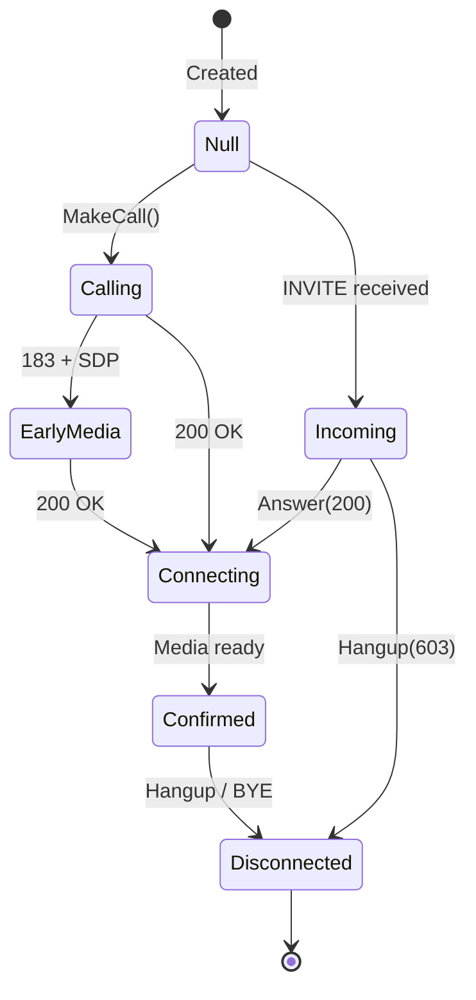
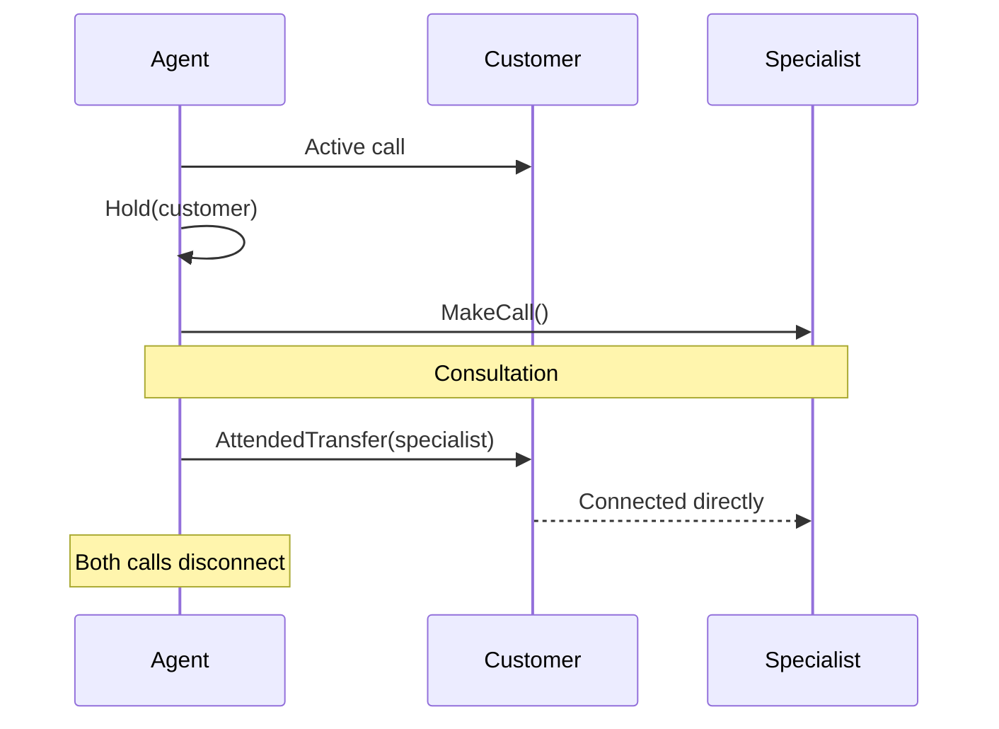

**[English](README.md)** | [Español](README.es.md)

<div align="center">

# ☎️ PjSip.Net

**High-level SIP telephony SDK for .NET 10**

[](https://www.nuget.org/packages/PjSip.Net)
[](https://www.nuget.org/packages/PjSip.Net)
[](https://github.com/mchinchilla/PjSip.Net/actions/workflows/native-build.yml)
[](https://github.com/mchinchilla/PjSip.Net/actions/workflows/release.yml)
[](LICENSE.txt)
[](https://dotnet.microsoft.com/)

Based on [PJSIP 2.16](https://www.pjsip.org/) with native TLS support (Schannel on Windows, OpenSSL on Android)
Compatible with **WinForms** · **WPF** · **MAUI** · **Mac Catalyst** · **Console**

</div>

---

### ✨ Key Features

| | Feature | Description |
|---|---|---|
| 📞 | **Call Management** | Make, receive, hold, transfer, and record calls |
| 🔒 | **Native TLS** | Schannel (Windows), Secure Transport (macOS/iOS), OpenSSL (Android) |
| 👥 | **Presence & BLF** | Monitor user availability with SUBSCRIBE/NOTIFY |
| 🎙️ | **Audio Control** | Device selection, volume, mute, codec management (G.711, G.729, Opus, Speex, GSM, iLBC) |
| 🔀 | **Conferencing** | Multi-party audio bridge with merge/split |
| 💬 | **SIP Messaging** | Send and receive text messages via SIP MESSAGE (RFC 3428) |
| 📊 | **Call Quality** | Real-time RTP stats, jitter, packet loss, MOS score |
| 🌐 | **NAT Traversal** | STUN, ICE, and TURN support built-in |
| 💉 | **Dependency Injection** | First-class `IServiceCollection` integration |
| 📱 | **Multi-Platform** | Windows, macOS, Android, iOS from a single API |

---

## 📑 Table of Contents

- [Requirements](#-requirements)
- [Installation](#-installation)
- [Quick Start](#-quick-start)
- [Configuration](#️-configuration)
  - [SipPhoneOptions](#sipphoneoptions)
  - [SipAccountOptions](#sipaccountoptions)
  - [Transport and TLS](#-transport-and-tls)
  - [NAT/STUN/ICE/TURN](#-natstuniceurn)
- [Dependency Injection](#-dependency-injection)
- [API Reference](#-api-reference)
  - [ISipPhone](#isipphone)
  - [ISipAccount](#isipaccount)
  - [ISipCall](#isipcall)
  - [ISipAudioManager](#isipaudiomanager)
  - [ISipCodecManager](#isipcodecmanager)
  - [ISipPresenceManager](#isippresencemanager)
  - [ISipMessaging](#isipmessaging)
  - [ISipConferenceBridge](#isipconferencebridge)
  - [ISipCallRecorder](#isipcallrecorder)
  - [ISipToneGenerator](#isiptonegenerator)
  - [ISipCallQualityMonitor](#isipcallqualitymonitor)
  - [ISipCallHistory](#isipcallhistory)
  - [ISipNetworkMonitor](#isipnetworkmonitor)
- [Events](#-events)
- [Advanced Features](#-advanced-features)
- [Platform Examples](#-platform-examples)
- [Error Handling](#-error-handling)
- [Audio](#-audio)
- [Low-Level Access (pjsua2)](#-low-level-access-pjsua2)
- [Architecture](#️-architecture)
- [Supported Platforms](#-supported-platforms)
- [Build from Source](#️-build-from-source)

---

## 📋 Requirements

- **.NET 10** SDK or higher
- **Native package** corresponding to your platform (installed automatically via NuGet)

## 📦 Installation

```bash
# Main SDK (required)
dotnet add package PjSip.Net

# Native binaries — install the one for your target platform
dotnet add package PjSip.Net.Native.Win64        # Windows x64
dotnet add package PjSip.Net.Native.MacOS         # macOS x64 / arm64
dotnet add package PjSip.Net.Native.Android       # Android arm64
dotnet add package PjSip.Net.Native.iOS           # iOS arm64
```

> **Note:** The native package contains the compiled `pjsua2` binary and is automatically copied to the output directory.

---

## 🚀 Quick Start

```csharp
using Microsoft.Extensions.DependencyInjection;
using PjSip.Net;
using PjSip.Net.Accounts;
using PjSip.Net.DependencyInjection;
using PjSip.Net.Transport;

// 1. Configure services
var services = new ServiceCollection();
services.AddLogging();
services.AddPjSip(options =>
{
    options.Transports.Add(new SipTransportOptions
    {
        Type = SipTransportType.Udp,
        Port = 5060
    });
    options.Accounts.Add(new SipAccountOptions
    {
        Username = "1001",
        Password = "secret",
        Domain = "pbx.mycompany.com",
        Registrar = "sip:pbx.mycompany.com"
    });
});

// 2. Resolve and start
var provider = services.BuildServiceProvider();
var phone = provider.GetRequiredService<ISipPhone>();

phone.IncomingCall += (s, e) =>
{
    Console.WriteLine($"Incoming call from {e.RemoteUri}");
    e.Call.Answer();  // Answer automatically
};

phone.CallStateChanged += (s, e) =>
    Console.WriteLine($"Call {e.Call.Id}: {e.OldState} -> {e.NewState}");

await phone.StartAsync();

// 3. Make a call
var call = phone.MakeCall(phone.Accounts[0], "sip:1002@pbx.mycompany.com");

// 4. Hang up
call.Hangup();

// 5. Shutdown cleanly
await phone.StopAsync();
```

---

## ⚙️ Configuration

### SipPhoneOptions

Global SIP endpoint options. Configured when registering the service.

```csharp
services.AddPjSip(options =>
{
    options.UserAgent = "MyApp/2.0";        // User-Agent in SIP headers (default: "PjSip.Net/1.0")
    options.LogLevel = 4;                    // PJSIP log level: 0=fatal, 5=trace (default: 4)
    options.MaxCalls = 8;                    // Maximum simultaneous calls (default: 4)
    options.UseCompactForm = false;          // Compact SIP headers (default: false)
    options.CallHistoryMaxEntries = 1000;    // Maximum history entries (default: 1000)
    options.Transports = [ ... ];            // List of transports to create
    options.Accounts = [ ... ];             // Accounts to register on start
    options.Nat = new NatOptions { ... };   // NAT/STUN/ICE/TURN configuration
});
```

| Property | Type | Default | Description |
|---|---|---|---|
| `UserAgent` | `string` | `"PjSip.Net/1.0"` | User-Agent header value in SIP messages |
| `LogLevel` | `int` | `4` | PJSIP internal log verbosity (0-5) |
| `MaxCalls` | `int` | `4` | Maximum number of simultaneous calls |
| `UseCompactForm` | `bool` | `false` | Use compact form for SIP headers |
| `CallHistoryMaxEntries` | `int` | `1000` | Maximum entries stored in call history |
| `Transports` | `List<SipTransportOptions>` | `[]` | SIP transports to create on startup |
| `Accounts` | `List<SipAccountOptions>` | `[]` | SIP accounts to register automatically |
| `Nat` | `NatOptions` | `new()` | NAT traversal configuration (STUN/ICE/TURN) |

### SipAccountOptions

Configuration for an individual SIP account.

```csharp
new SipAccountOptions
{
    Username = "1001",                       // SIP username (required)
    Password = "secret",                     // Password (required)
    Domain = "pbx.mycompany.com",           // SIP domain (required)
    Registrar = "sip:pbx.mycompany.com",    // Registrar URI (null = uses Domain)
    DisplayName = "John Doe",               // Display name for caller ID
    Realm = "*",                             // Authentication realm (null = automatic)
    RegistrationTimeout = 300,               // Registration expiration in seconds (default: 300)
    RegisterOnAdd = true                     // Register automatically when added (default: true)
}
```

| Property | Type | Default | Description |
|---|---|---|---|
| `Username` | `string` | *required* | SIP username for authentication |
| `Password` | `string` | *required* | Account password |
| `Domain` | `string` | *required* | SIP domain/server |
| `Registrar` | `string?` | `null` | Complete registrar URI. If `null`, constructed from `Domain` |
| `DisplayName` | `string?` | `null` | Display name in Caller ID |
| `Realm` | `string?` | `null` | Realm for digest auth. `null` = accepts any challenge |
| `RegistrationTimeout` | `int` | `300` | REGISTER expiration time in seconds |
| `RegisterOnAdd` | `bool` | `true` | If `true`, sends REGISTER automatically when adding account |

### 🔐 Transport and TLS

```csharp
// UDP (unencrypted)
options.Transports.Add(new SipTransportOptions
{
    Type = SipTransportType.Udp,
    Port = 5060
});

// TCP
options.Transports.Add(new SipTransportOptions
{
    Type = SipTransportType.Tcp,
    Port = 5060
});

// TLS (encrypted) — Uses Schannel on Windows, no OpenSSL dependency
options.Transports.Add(new SipTransportOptions
{
    Type = SipTransportType.Tls,
    Port = 5061,
    Tls = new TlsOptions
    {
        VerifyServer = true,               // Validate server certificate (default: true)
        VerifyClient = false,              // Require client certificate (default: false)
        CertificateFile = null,            // Path to client certificate (.pem)
        PrivateKeyFile = null,             // Path to client private key (.pem)
        CaListFile = null                  // Path to additional trusted CAs (.pem)
    }
});

// IPv6
options.Transports.Add(new SipTransportOptions
{
    Type = SipTransportType.Tls6,          // TLS over IPv6
    Port = 5061
});
```

**Available transport types:**

| Enum | Protocol | Default Port |
|---|---|---|
| `SipTransportType.Udp` | UDP/IPv4 | 5060 |
| `SipTransportType.Tcp` | TCP/IPv4 | 5060 |
| `SipTransportType.Tls` | TLS/IPv4 | 5061 |
| `SipTransportType.Udp6` | UDP/IPv6 | 5060 |
| `SipTransportType.Tcp6` | TCP/IPv6 | 5060 |
| `SipTransportType.Tls6` | TLS/IPv6 | 5061 |

**TlsOptions:**

| Property | Type | Default | Description |
|---|---|---|---|
| `VerifyServer` | `bool` | `true` | Validate server TLS certificate |
| `VerifyClient` | `bool` | `false` | Require client TLS certificate |
| `CertificateFile` | `string?` | `null` | Path to client certificate (PEM format) |
| `PrivateKeyFile` | `string?` | `null` | Path to client private key (PEM format) |
| `CaListFile` | `string?` | `null` | Path to additional trusted CA list |

> **Windows:** TLS uses Schannel (OS native). No need to install OpenSSL.
> **macOS/iOS:** Uses system Secure Transport.
> **Android:** TLS enabled via OpenSSL 3.4.1 (statically linked).

### 🌐 NAT/STUN/ICE/TURN

NAT traversal configuration for networks behind firewalls or NAT routers.

```csharp
options.Nat = new NatOptions
{
    EnableStun = true,
    StunServers = ["stun.l.google.com:19302", "stun1.l.google.com:19302"],
    EnableIce = true,                        // ICE for media NAT traversal (default: true)
    EnableTurn = false,                      // TURN relay (for symmetric NAT)
    TurnServer = "turn.mycompany.com:3478",
    TurnUsername = "user",
    TurnPassword = "pass",
    TurnTransport = NatTraversalType.Udp,   // TURN transport: Udp, Tcp, Tls
    IceAggressiveNomination = false          // ICE aggressive nomination
};
```

| Property | Type | Default | Description |
|---|---|---|---|
| `EnableStun` | `bool` | `false` | Enable STUN resolution to discover public IP |
| `StunServers` | `List<string>` | `[]` | List of STUN servers (`host:port`) |
| `EnableIce` | `bool` | `true` | Enable ICE for media NAT traversal |
| `EnableTurn` | `bool` | `false` | Enable TURN relay for symmetric NAT |
| `TurnServer` | `string?` | `null` | TURN server address (`host:port`) |
| `TurnUsername` | `string?` | `null` | Username for TURN authentication |
| `TurnPassword` | `string?` | `null` | Password for TURN authentication |
| `TurnTransport` | `NatTraversalType` | `Udp` | TURN transport: `Udp`, `Tcp`, `Tls` |
| `IceAggressiveNomination` | `bool` | `false` | ICE aggressive nomination (faster, less reliable) |

---

## 💉 Dependency Injection

### Basic registration (Singleton)

```csharp
services.AddPjSip(options =>
{
    options.Transports.Add(new SipTransportOptions { Type = SipTransportType.Udp });
    options.Accounts.Add(new SipAccountOptions
    {
        Username = "1001",
        Password = "secret",
        Domain = "pbx.mycompany.com"
    });
});
```

### Registration with explicit lifetime

```csharp
using PjSip.Net.DependencyInjection;

// Singleton (default) — one instance for entire application
services.AddPjSip(options => { ... }, PjSipServiceLifetime.Singleton);

// Scoped — one instance per scope (useful in web applications)
services.AddPjSip(options => { ... }, PjSipServiceLifetime.Scoped);
```

### Registered services

`AddPjSip` automatically registers:

| Service | Description |
|---|---|
| `ISipPhone` | Main facade — manages accounts, calls, and transport |
| `ISipAudioManager` | Audio device management (microphone, speaker, volume) |
| `ISipCodecManager` | Audio codec management (priorities, enable/disable) |
| `ISipPresenceManager` | Presence and BLF (Busy Lamp Field) |
| `ISipMessaging` | SIP messaging (SIP MESSAGE) |
| `ISipConferenceBridge` | Audio conferencing (bridge) |
| `ISipCallRecorder` | Call recording |
| `ISipToneGenerator` | Tone generator (ringback, busy, dial, DTMF) |
| `ISipCallQualityMonitor` | Call quality monitoring (RTP stats, MOS) |
| `ISipCallHistory` | Call history |
| `ISipNetworkMonitor` | Network change monitoring |

### Inject into your classes

```csharp
public class MyTelephonyService
{
    private readonly ISipPhone _phone;

    public MyTelephonyService(ISipPhone phone)
    {
        _phone = phone;
        _phone.IncomingCall += OnIncomingCall;
    }

    public async Task StartAsync()
    {
        await _phone.StartAsync();
    }

    public ISipCall Call(string destination)
    {
        return _phone.MakeCall(_phone.Accounts[0], destination);
    }

    private void OnIncomingCall(object? sender, IncomingCallEventArgs e)
    {
        // Logic for incoming calls
    }
}
```

You can also inject sub-managers directly:

```csharp
public class MyPresenceService
{
    private readonly ISipPresenceManager _presence;
    private readonly ISipCallHistory _history;

    public MyPresenceService(ISipPresenceManager presence, ISipCallHistory history)
    {
        _presence = presence;
        _history = history;
    }

    public async Task ShowAvailableAsync()
    {
        await _presence.SetMyPresenceAsync(BuddyState.Online, "Available");
    }

    public int MissedCallsToday()
    {
        return _history.GetMissedCalls().Count;
    }
}
```

---

## 📖 API Reference

### ISipPhone

Main SDK facade. Manages the SIP endpoint lifecycle, accounts, calls, and all sub-managers.

```csharp
public interface ISipPhone : IAsyncDisposable, IDisposable
```

**Properties:**

| Property | Type | Description |
|---|---|---|
| `State` | `SipPhoneState` | Current phone state |
| `Accounts` | `IReadOnlyList<ISipAccount>` | Registered SIP accounts |
| `Audio` | `ISipAudioManager` | Audio device manager |
| `Codecs` | `ISipCodecManager` | Audio codec manager |
| `Presence` | `ISipPresenceManager` | Presence and BLF manager |
| `Messaging` | `ISipMessaging` | SIP messaging (MESSAGE) |
| `Conference` | `ISipConferenceBridge` | Conference bridge |
| `Recorder` | `ISipCallRecorder` | Call recorder |
| `Tones` | `ISipToneGenerator` | Tone generator |
| `Quality` | `ISipCallQualityMonitor` | Call quality monitor |
| `History` | `ISipCallHistory` | Call history |
| `Network` | `ISipNetworkMonitor` | Network change monitor |

**Methods:**

| Method | Return | Description |
|---|---|---|
| `StartAsync(ct)` | `Task` | Initializes PJSIP, creates transports and registers configured accounts |
| `StopAsync(ct)` | `Task` | Hangs up all calls, unregisters accounts and destroys endpoint |
| `AddAccount(options)` | `ISipAccount` | Adds a new SIP account at runtime |
| `RemoveAccount(account)` | `void` | Removes and unregisters an account |
| `MakeCall(account, uri)` | `ISipCall` | Initiates an outgoing call from an account |
| `MakeCall(account, uri, headers)` | `ISipCall` | Initiates an outgoing call with custom SIP headers |

**Events:**

| Event | EventArgs | Description |
|---|---|---|
| `IncomingCall` | `IncomingCallEventArgs` | Incoming call on any account |
| `CallStateChanged` | `CallStateChangedEventArgs` | State change in any call |
| `RegistrationStateChanged` | `RegistrationStateChangedEventArgs` | Registration change in any account |
| `TransportStateChanged` | `TransportStateChangedEventArgs` | Transport state change |
| `MwiStateChanged` | `MwiStateChangedEventArgs` | New message waiting indicator (voicemail) |

**States (`SipPhoneState`):**

| State | Description |
|---|---|
| `Idle` | Newly created, not initialized |
| `Starting` | Initializing PJSIP endpoint |
| `Running` | Operational — can make and receive calls |
| `Stopping` | Shutting down |
| `Stopped` | Cleanly stopped |
| `Error` | Error during startup or shutdown |

---

### ISipAccount

Represents a SIP account from which calls can be sent/received.

```csharp
public interface ISipAccount : IDisposable
```

**Properties:**

| Property | Type | Description |
|---|---|---|
| `Id` | `string` | Unique account identifier |
| `Uri` | `string` | SIP URI of the account (e.g., `sip:1001@pbx.com`) |
| `RegistrationState` | `SipRegistrationState` | Current registration state |
| `Options` | `SipAccountOptions` | Account configuration |
| `ActiveCalls` | `IReadOnlyList<ISipCall>` | Active calls on this account |
| `DndMode` | `DndMode` | Do Not Disturb mode (read/write) |
| `CallForwarding` | `CallForwardingOptions` | Call forwarding configuration |
| `MwiInfo` | `MwiInfo?` | Message waiting information (voicemail), `null` if no data |

**Methods:**

| Method | Return | Description |
|---|---|---|
| `RegisterAsync(ct)` | `Task` | Sends REGISTER to server |
| `UnregisterAsync(ct)` | `Task` | Sends un-REGISTER to server |
| `MakeCall(destinationUri)` | `ISipCall` | Initiates a call from this account |
| `MakeCall(destinationUri, headers)` | `ISipCall` | Initiates a call with custom SIP headers |

**Events:**

| Event | EventArgs | Description |
|---|---|---|
| `RegistrationStateChanged` | `RegistrationStateChangedEventArgs` | Registration state change |
| `IncomingCall` | `IncomingCallEventArgs` | Incoming call for this account |
| `MwiStateChanged` | `MwiStateChangedEventArgs` | New voicemail state |

**Registration states (`SipRegistrationState`):**

| State | Description |
|---|---|
| `Unregistered` | Not registered |
| `Registering` | REGISTER sent, waiting for response |
| `Registered` | Successfully registered (200 OK) |
| `Unregistering` | Un-REGISTER sent |
| `Error` | Registration error (401, 403, timeout, etc.) |

---

### ISipCall

Represents an active SIP call (incoming or outgoing).

```csharp
public interface ISipCall : IDisposable
```

**Properties:**

| Property | Type | Description |
|---|---|---|
| `Id` | `string` | Unique call identifier |
| `State` | `SipCallState` | Current call state |
| `Direction` | `CallDirection` | `Incoming` or `Outgoing` |
| `Info` | `SipCallInfo` | Detailed information (URIs, duration, status code) |
| `CustomHeaders` | `IReadOnlyList<SipHeader>` | Custom SIP headers from the call |
| `IsMuted` | `bool` | If microphone is muted for this call |
| `IsOnHold` | `bool` | If call is on hold |

**Methods:**

| Method | Description |
|---|---|
| `Answer(statusCode)` | Answer the call. Default: `200` (OK) |
| `Answer(statusCode, headers)` | Answer with custom SIP headers |
| `Hangup(statusCode)` | Hang up the call. Default: `603` (Decline) |
| `Hold()` | Put on hold |
| `Unhold()` | Remove from hold (re-INVITE) |
| `Transfer(destinationUri)` | Transfer call to another destination (REFER) |
| `AttendedTransfer(targetCall)` | Attended transfer — connects this call with another active call |
| `SendDtmf(digits)` | Send DTMF tones (e.g., `"1234#"`) |
| `SetMute(mute)` | Mute/unmute microphone |

**Common response codes for `Answer()`:**

| Code | Meaning |
|---|---|
| `180` | Ringing (without answering, only signal ring) |
| `200` | OK — answer the call |
| `486` | Busy Here — reject as busy |
| `603` | Decline — reject the call |

**Call states (`SipCallState`):**



| State | Description |
|---|---|
| `Null` | Newly created call |
| `Calling` | INVITE sent, waiting for response |
| `Incoming` | INVITE received, not answered |
| `EarlyMedia` | Receiving early media (183 + SDP) |
| `Connecting` | 2xx response received, establishing media |
| `Confirmed` | Active call with bidirectional audio |
| `Disconnected` | Call terminated |

**SipCallInfo (call information):**

| Property | Type | Description |
|---|---|---|
| `CallId` | `string` | Call-ID from SIP header |
| `RemoteUri` | `string` | Remote party URI |
| `LocalUri` | `string` | Local URI |
| `State` | `SipCallState` | Current state |
| `Direction` | `CallDirection` | Call direction |
| `Duration` | `TimeSpan` | Call duration |
| `RemoteDisplayName` | `string?` | Remote caller display name |
| `StatusCode` | `int` | Last SIP code received |
| `StatusText` | `string?` | Text of last SIP status |

**SipHeader (custom header):**

```csharp
public sealed record SipHeader
{
    public required string Name { get; init; }
    public required string Value { get; init; }
}
```

---

### ISipAudioManager

Audio device and volume management.

```csharp
public interface ISipAudioManager
```

**Properties:**

| Property | Type | Description |
|---|---|---|
| `CurrentInputDevice` | `AudioDeviceInfo?` | Current active microphone |
| `CurrentOutputDevice` | `AudioDeviceInfo?` | Current active speaker/headset |
| `InputLevel` | `float` | Input volume level (0.0 — 1.0) |
| `OutputLevel` | `float` | Output volume level (0.0 — 1.0) |

**Methods:**

| Method | Return | Description |
|---|---|---|
| `GetInputDevices()` | `IReadOnlyList<AudioDeviceInfo>` | List of available microphones |
| `GetOutputDevices()` | `IReadOnlyList<AudioDeviceInfo>` | List of available speakers |
| `SetInputDevice(deviceId)` | `void` | Change active microphone |
| `SetOutputDevice(deviceId)` | `void` | Change active speaker |

**AudioDeviceInfo:**

| Property | Type | Description |
|---|---|---|
| `DeviceId` | `int` | Device ID |
| `Name` | `string` | Device name (e.g., "Realtek HD Audio") |
| `InputChannels` | `int` | Number of input channels |
| `OutputChannels` | `int` | Number of output channels |
| `Driver` | `string?` | Audio driver name |

---

### ISipCodecManager

Audio codec management: list, prioritize, enable and disable.

```csharp
public interface ISipCodecManager
```

**Methods:**

| Method | Return | Description |
|---|---|---|
| `GetCodecs()` | `IReadOnlyList<CodecInfo>` | List of available codecs with their priorities |
| `SetCodecPriority(codecId, priority)` | `void` | Set codec priority (0-255, 0 = disabled) |
| `EnableCodec(codecId, priority)` | `void` | Enable codec with optional priority (default: 128) |
| `DisableCodec(codecId)` | `void` | Disable codec (priority = 0) |

**CodecInfo:**

| Property | Type | Description |
|---|---|---|
| `CodecId` | `string` | Codec identifier (e.g., `"PCMU/8000"`, `"opus/48000"`, `"G729/8000"`) |
| `Description` | `string` | Human-readable codec description |
| `Priority` | `int` | Current priority (0-255, 0 = disabled) |
| `ClockRate` | `int` | Sampling frequency in Hz |
| `ChannelCount` | `int` | Number of audio channels |

---

### ISipPresenceManager

Presence management (SUBSCRIBE/NOTIFY) and BLF (Busy Lamp Field).

```csharp
public interface ISipPresenceManager
```

**Properties:**

| Property | Type | Description |
|---|---|---|
| `Buddies` | `IReadOnlyList<ISipBuddy>` | List of monitored buddies |
| `MyState` | `BuddyState` | My current presence state |

**Methods:**

| Method | Return | Description |
|---|---|---|
| `AddBuddy(uri)` | `ISipBuddy` | Add a buddy to monitor their presence |
| `RemoveBuddy(buddy)` | `void` | Stop monitoring a buddy |
| `SetMyPresenceAsync(state, statusText, ct)` | `Task` | Publish my presence state |

**Events:**

| Event | EventArgs | Description |
|---|---|---|
| `BuddyStateChanged` | `BuddyStateChangedEventArgs` | Buddy state change |

**ISipBuddy:**

| Property/Method | Type | Description |
|---|---|---|
| `Uri` | `string` | Buddy SIP URI |
| `State` | `BuddyState` | Current state |
| `Info` | `BuddyInfo` | Complete information (name, state, text, timestamp) |
| `StateChanged` | `event` | State change notification |
| `SubscribeAsync(ct)` | `Task` | Subscribe to presence notifications |
| `UnsubscribeAsync(ct)` | `Task` | Cancel subscription |

**BuddyState:**

| State | Description |
|---|---|
| `Unknown` | Unknown state |
| `Online` | Available |
| `Away` | Away |
| `Busy` | Busy |
| `OnThePhone` | On a call |
| `Offline` | Offline |

---

### ISipMessaging

Sending and receiving SIP messages (MESSAGE method, RFC 3428).

```csharp
public interface ISipMessaging
```

**Methods:**

| Method | Return | Description |
|---|---|---|
| `SendMessageAsync(account, destUri, body, contentType, ct)` | `Task` | Send a SIP message. `contentType` default: `"text/plain"` |

**Events:**

| Event | EventArgs | Description |
|---|---|---|
| `MessageReceived` | `SipMessageReceivedEventArgs` | Message received (contains `SipMessage`) |
| `MessageStatus` | `SipMessageStatusEventArgs` | Delivery status of sent message |

**SipMessage:**

| Property | Type | Description |
|---|---|---|
| `From` | `string` | Sender URI |
| `To` | `string` | Recipient URI |
| `Body` | `string` | Message body |
| `ContentType` | `string` | Content type (default: `"text/plain"`) |
| `Timestamp` | `DateTime` | Message time (UTC) |

---

### ISipConferenceBridge

Conference bridge for mixing audio from multiple calls.

```csharp
public interface ISipConferenceBridge
```

**Properties:**

| Property | Type | Description |
|---|---|---|
| `Participants` | `IReadOnlyList<ISipCall>` | Calls currently in conference |

**Methods:**

| Method | Return | Description |
|---|---|---|
| `AddParticipant(call)` | `void` | Add a call to conference |
| `RemoveParticipant(call)` | `void` | Remove a call from conference |
| `MergeAll(calls)` | `void` | Merge multiple calls into one conference |
| `SplitAll()` | `void` | Split all calls from conference |

---

### ISipCallRecorder

Call recording to file.

```csharp
public interface ISipCallRecorder : IDisposable
```

**Properties:**

| Property | Type | Description |
|---|---|---|
| `IsRecording` | `bool` | If recording is in progress |
| `CurrentFilePath` | `string?` | Current file path, `null` if not recording |

**Methods:**

| Method | Return | Description |
|---|---|---|
| `StartRecording(call, filePath, format)` | `void` | Start recording. `format` default: `Wav` |
| `StopRecording()` | `void` | Stop current recording |

**Events:**

| Event | EventArgs | Description |
|---|---|---|
| `RecordingStateChanged` | `RecordingStateChangedEventArgs` | Recording state change |

**RecordingFormat:**

| Value | Description |
|---|---|
| `Wav` | Uncompressed WAV format |

---

### ISipToneGenerator

Signaling tone generator.

```csharp
public interface ISipToneGenerator : IDisposable
```

**Properties:**

| Property | Type | Description |
|---|---|---|
| `IsPlaying` | `bool` | If a tone is playing |

**Methods:**

| Method | Return | Description |
|---|---|---|
| `PlayTone(tone)` | `void` | Play a predefined tone type |
| `PlayTones(tones)` | `void` | Play a custom tone sequence |
| `PlayRingbackTone()` | `void` | Ringback tone (North American: 440+480 Hz) |
| `PlayBusyTone()` | `void` | Busy tone (480+620 Hz) |
| `PlayDialTone()` | `void` | Dial tone (350+440 Hz) |
| `Stop()` | `void` | Stop current tone |

**ToneDescriptor (for custom tones):**

| Property | Type | Description |
|---|---|---|
| `Frequency1` | `int` | First frequency in Hz |
| `Frequency2` | `int` | Second frequency in Hz (0 = single tone) |
| `OnMs` | `int` | Tone duration in milliseconds |
| `OffMs` | `int` | Silence duration in milliseconds |
| `Volume` | `int` | Volume (default: 16000) |

**ToneType:**

| Value | Description |
|---|---|
| `Ringback` | Standard ringback tone |
| `Busy` | Busy tone |
| `Dial` | Dial tone |
| `Custom` | Custom tone |

---

### ISipCallQualityMonitor

Call quality monitoring: RTP statistics, jitter, packet loss and MOS score.

```csharp
public interface ISipCallQualityMonitor
```

**Methods:**

| Method | Return | Description |
|---|---|---|
| `GetQuality(call)` | `CallQualityInfo?` | Get current call quality (synchronous) |
| `GetQualityAsync(call, ct)` | `Task<CallQualityInfo?>` | Get current quality (asynchronous, thread-safe) |

**Events:**

| Event | EventArgs | Description |
|---|---|---|
| `QualityReportAvailable` | `CallQualityEventArgs` | Quality report available |

**CallQualityInfo:**

| Property | Type | Description |
|---|---|---|
| `CallId` | `string` | Call ID |
| `Duration` | `TimeSpan` | Call duration at measurement time |
| `RtpPacketsSent` | `long` | Total RTP packets sent |
| `RtpPacketsReceived` | `long` | Total RTP packets received |
| `RtpPacketsLost` | `long` | Lost RTP packets |
| `RtpLossPercentage` | `double` | Packet loss percentage |
| `RtpJitterMs` | `int` | Jitter in milliseconds |
| `RtpRoundTripTimeMs` | `int` | Round-trip time in milliseconds |
| `CodecName` | `string?` | Active codec in call |
| `CodecClockRate` | `int` | Active codec clock rate |
| `MosScore` | `double` | Estimated Mean Opinion Score (1.0 — 5.0) |

---

### ISipCallHistory

Call history with filtering by type.

```csharp
public interface ISipCallHistory
```

**Properties:**

| Property | Type | Description |
|---|---|---|
| `Entries` | `IReadOnlyList<CallHistoryEntry>` | All history entries |

**Methods:**

| Method | Return | Description |
|---|---|---|
| `GetMissedCalls()` | `IReadOnlyList<CallHistoryEntry>` | Unanswered incoming calls |
| `GetIncomingCalls()` | `IReadOnlyList<CallHistoryEntry>` | All incoming calls |
| `GetOutgoingCalls()` | `IReadOnlyList<CallHistoryEntry>` | All outgoing calls |
| `Clear()` | `void` | Clear history |

**Events:**

| Event | EventArgs | Description |
|---|---|---|
| `EntryAdded` | `CallHistoryEntry` | New entry added to history |

**CallHistoryEntry:**

| Property | Type | Description |
|---|---|---|
| `CallId` | `string` | Call ID |
| `RemoteUri` | `string` | Remote party URI |
| `RemoteDisplayName` | `string?` | Remote party display name |
| `Direction` | `CallDirection` | `Incoming` or `Outgoing` |
| `StartTime` | `DateTime` | Start time |
| `EndTime` | `DateTime?` | End time |
| `Duration` | `TimeSpan` | Call duration |
| `FinalState` | `SipCallState` | Final call state |
| `StatusCode` | `int` | Final SIP code |
| `AccountUri` | `string?` | Local account URI |

---

### ISipNetworkMonitor

Network change monitoring to automatically re-register accounts.

```csharp
public interface ISipNetworkMonitor : IDisposable
```

**Properties:**

| Property | Type | Description |
|---|---|---|
| `CurrentState` | `NetworkState` | Current network state |

**Methods:**

| Method | Return | Description |
|---|---|---|
| `HandleNetworkChangeAsync(ct)` | `Task` | Manually notify network change (re-registers accounts, restarts transports) |

**Events:**

| Event | EventArgs | Description |
|---|---|---|
| `NetworkStateChanged` | `NetworkStateChangedEventArgs` | Network state change |

**NetworkState:**

| State | Description |
|---|---|
| `Connected` | Network connected |
| `Disconnected` | No network connectivity |
| `Changed` | Network changed (new IP, WiFi/data change) |

---

## 🔔 Events

All events are fired on the thread that processed the PJSIP callback. In UI applications (WinForms/WPF/MAUI), use the corresponding dispatcher to update the interface.

### In ISipPhone (global level)

```csharp
// Incoming call on any account
phone.IncomingCall += (sender, e) =>
{
    Console.WriteLine($"Call from {e.RemoteDisplayName} <{e.RemoteUri}>");
    Console.WriteLine($"Target account: {e.Account.Uri}");

    e.Call.Answer();           // Answer
    // or: e.Call.Hangup(486);  // Reject as busy
};

// State change in any call
phone.CallStateChanged += (sender, e) =>
{
    Console.WriteLine($"Call {e.Call.Id}: {e.OldState} -> {e.NewState}");

    if (e.NewState == SipCallState.Disconnected)
        Console.WriteLine("Call ended");
};

// Registration change in any account
phone.RegistrationStateChanged += (sender, e) =>
{
    Console.WriteLine($"Account {e.Account.Uri}: {e.OldState} -> {e.NewState}");

    if (e.NewState == SipRegistrationState.Error)
        Console.WriteLine($"Registration error: {e.StatusCode} {e.Reason}");
};

// Transport state change
phone.TransportStateChanged += (sender, e) =>
{
    Console.WriteLine($"Transport {e.TransportType}: {e.State}");
};

// Message Waiting Indicator (voicemail)
phone.MwiStateChanged += (sender, e) =>
{
    Console.WriteLine($"Account {e.Account.Uri}: {e.MwiInfo.NewMessages} new message(s)");
};
```

### In ISipAccount (account level)

```csharp
var account = phone.Accounts[0];

account.RegistrationStateChanged += (sender, e) =>
    Console.WriteLine($"My account: {e.NewState}");

account.IncomingCall += (sender, e) =>
    Console.WriteLine($"Incoming call for this account: {e.RemoteUri}");

account.MwiStateChanged += (sender, e) =>
    Console.WriteLine($"Voicemail: {e.MwiInfo.NewMessages} new, {e.MwiInfo.OldMessages} old");
```

### In ISipCall (call level)

```csharp
var call = phone.MakeCall(account, "sip:1002@pbx.com");

call.StateChanged += (sender, e) =>
{
    Console.WriteLine($"State: {e.OldState} -> {e.NewState}");

    if (e.NewState == SipCallState.Confirmed)
        Console.WriteLine("Audio active!");
};

call.MediaStateChanged += (sender, e) =>
{
    Console.WriteLine($"Media active: {e.IsActive}");
};
```

---

## 🧩 Advanced Features

### 👥 Presence and BLF

Monitoring presence state of other users (Busy Lamp Field).

```csharp
var presence = phone.Presence;

// Publish my state
await presence.SetMyPresenceAsync(BuddyState.Online, "Available");

// Add a buddy to monitor
var buddy = presence.AddBuddy("sip:1002@pbx.com");
await buddy.SubscribeAsync();

// Listen to state changes
buddy.StateChanged += (s, e) =>
    Console.WriteLine($"{buddy.Uri}: {e.OldState} -> {e.NewState}");

// Also at global level
presence.BuddyStateChanged += (s, e) =>
    Console.WriteLine($"Buddy {e.Buddy.Uri}: {e.NewState}");

// Query current state
Console.WriteLine($"Current state: {buddy.State}");
Console.WriteLine($"Last updated: {buddy.Info.LastUpdated}");

// Stop monitoring
await buddy.UnsubscribeAsync();
presence.RemoveBuddy(buddy);
```

### 💬 SIP Messaging (MESSAGE)

Sending and receiving text messages via SIP MESSAGE (RFC 3428).

```csharp
var messaging = phone.Messaging;

// Send a message
await messaging.SendMessageAsync(
    phone.Accounts[0],
    "sip:1002@pbx.com",
    "Hello, are you available for a call?"
);

// Receive messages
messaging.MessageReceived += (s, e) =>
    Console.WriteLine($"Message from {e.Message.From}: {e.Message.Body}");

// Delivery status
messaging.MessageStatus += (s, e) =>
    Console.WriteLine($"Message to {e.DestinationUri}: code {e.StatusCode}");
```

### 🔀 Conference

Mixing audio from multiple calls into a conference.

```csharp
var conference = phone.Conference;
var account = phone.Accounts[0];

// Create calls
var call1 = phone.MakeCall(account, "sip:1002@pbx.com");
var call2 = phone.MakeCall(account, "sip:1003@pbx.com");

// Wait until connected, then merge
conference.AddParticipant(call1);
conference.AddParticipant(call2);

// View participants
Console.WriteLine($"Participants: {conference.Participants.Count}");

// Merge all at once
conference.MergeAll(new[] { call1, call2 });

// Split all
conference.SplitAll();

// Remove one
conference.RemoveParticipant(call2);
```

### 🎙️ Call Recording

Recording call audio to file.

```csharp
var recorder = phone.Recorder;

// Start recording
recorder.StartRecording(call, @"C:\recordings\call-001.wav");

// Check status
Console.WriteLine($"Recording: {recorder.IsRecording}");
Console.WriteLine($"File: {recorder.CurrentFilePath}");

// Listen to state changes
recorder.RecordingStateChanged += (s, e) =>
    Console.WriteLine($"Recording: {(e.IsRecording ? "started" : "stopped")}");

// Stop recording
recorder.StopRecording();
```

### 🎵 Tone Generator

Playing standard or custom signaling tones.

```csharp
var tones = phone.Tones;

// Standard tones (North American frequencies)
tones.PlayDialTone();      // 350+440 Hz continuous
tones.PlayRingbackTone();  // 440+480 Hz, 2s on / 4s off
tones.PlayBusyTone();      // 480+620 Hz, 0.5s on / 0.5s off

// Generic tone by type
tones.PlayTone(ToneType.Busy);

// Custom tones
tones.PlayTones(new[]
{
    new ToneDescriptor { Frequency1 = 941, Frequency2 = 1336, OnMs = 100, OffMs = 100 },  // '#' key
    new ToneDescriptor { Frequency1 = 697, Frequency2 = 1209, OnMs = 100, OffMs = 100 },  // '1' key
});

// Stop
tones.Stop();
Console.WriteLine($"Playing: {tones.IsPlaying}");
```

### 📊 Call Quality

Monitoring RTP statistics and MOS score during an active call.

```csharp
var quality = phone.Quality;

// Query quality of an active call
var info = quality.GetQuality(call);
if (info != null)
{
    Console.WriteLine($"Codec: {info.CodecName}");
    Console.WriteLine($"Packets sent: {info.RtpPacketsSent}");
    Console.WriteLine($"Loss: {info.RtpLossPercentage:F1}%");
    Console.WriteLine($"Jitter: {info.RtpJitterMs}ms");
    Console.WriteLine($"RTT: {info.RtpRoundTripTimeMs}ms");
    Console.WriteLine($"MOS: {info.MosScore:F1}/5.0");
}

// Or asynchronously (thread-safe)
var asyncInfo = await quality.GetQualityAsync(call);

// Listen to periodic reports
quality.QualityReportAvailable += (s, e) =>
    Console.WriteLine($"Call {e.Call.Id}: MOS={e.Quality.MosScore:F1}");
```

### 📋 Call History

Automatic call history with filtering.

```csharp
var history = phone.History;

// History is filled automatically when a call disconnects

// Query all entries
foreach (var entry in history.Entries)
{
    Console.WriteLine($"[{entry.Direction}] {entry.RemoteUri} - " +
                      $"{entry.Duration:mm\\:ss} - {entry.FinalState}");
}

// Filter by type
var missed = history.GetMissedCalls();
var incoming = history.GetIncomingCalls();
var outgoing = history.GetOutgoingCalls();

Console.WriteLine($"Missed: {missed.Count}");
Console.WriteLine($"Incoming: {incoming.Count}");
Console.WriteLine($"Outgoing: {outgoing.Count}");

// Listen to new entries
history.EntryAdded += (s, entry) =>
    Console.WriteLine($"New entry: {entry.RemoteUri} ({entry.Direction})");

// Clear history
history.Clear();
```

> Maximum history size is configured with `SipPhoneOptions.CallHistoryMaxEntries` (default: 1000).

### 🔕 Do Not Disturb (DND)

Control incoming call behavior per account.

```csharp
var account = phone.Accounts[0];

// Activate DND — reject all calls
account.DndMode = DndMode.RejectAll;

// Reject with busy signal (486 Busy Here)
account.DndMode = DndMode.RejectWithBusy;

// Silent ring (call arrives but without tone)
account.DndMode = DndMode.SilentRing;

// Disable DND
account.DndMode = DndMode.Off;
```

**DND modes (`DndMode`):**

| Mode | Description |
|---|---|
| `Off` | Disabled — normal behavior |
| `RejectAll` | Rejects all incoming calls (603 Decline) |
| `RejectWithBusy` | Rejects with busy signal (486 Busy Here) |
| `SilentRing` | Call arrives but doesn't ring (silent ring) |

### ↪️ Call Forwarding

Configure call forwarding for an account.

```csharp
var account = phone.Accounts[0];

// Unconditional forwarding
account.CallForwarding.Enabled = true;
account.CallForwarding.Type = CallForwardingType.Unconditional;
account.CallForwarding.DestinationUri = "sip:1003@pbx.com";

// Forward on no answer (after 20 seconds)
account.CallForwarding.Type = CallForwardingType.OnNoAnswer;
account.CallForwarding.NoAnswerTimeout = TimeSpan.FromSeconds(20);

// Forward on busy
account.CallForwarding.Type = CallForwardingType.OnBusy;

// Disable
account.CallForwarding.Enabled = false;
```

**Forwarding types (`CallForwardingType`):**

| Type | Description |
|---|---|
| `Unconditional` | Forwards all calls immediately |
| `OnBusy` | Forwards if account is busy |
| `OnNoAnswer` | Forwards if not answered within configured timeout |
| `OnNotReachable` | Forwards if account is not available |

### 📬 Message Waiting Indicator (MWI)

Receiving voicemail notifications.

```csharp
var account = phone.Accounts[0];

// Listen to MWI changes at account level
account.MwiStateChanged += (s, e) =>
{
    Console.WriteLine($"Voicemail updated:");
    Console.WriteLine($"  Has waiting: {e.MwiInfo.HasWaiting}");
    Console.WriteLine($"  New: {e.MwiInfo.NewMessages}");
    Console.WriteLine($"  Old: {e.MwiInfo.OldMessages}");
    Console.WriteLine($"  New urgent: {e.MwiInfo.NewUrgentMessages}");
    Console.WriteLine($"  Old urgent: {e.MwiInfo.OldUrgentMessages}");
};

// Or at global level
phone.MwiStateChanged += (s, e) =>
    Console.WriteLine($"Account {e.Account.Uri}: {e.MwiInfo.NewMessages} new");

// Query current state (null if no notification received yet)
var mwi = account.MwiInfo;
if (mwi != null && mwi.HasWaiting)
    Console.WriteLine($"You have {mwi.NewMessages} voice message(s)");
```

**MwiInfo:**

| Property | Type | Description |
|---|---|---|
| `HasWaiting` | `bool` | If messages are waiting |
| `NewMessages` | `int` | Number of new messages |
| `OldMessages` | `int` | Number of already listened messages |
| `NewUrgentMessages` | `int` | New urgent messages |
| `OldUrgentMessages` | `int` | Already listened urgent messages |
| `AccountUri` | `string?` | Associated account URI |

### 🏷️ Custom Headers

Sending custom SIP headers in calls.

```csharp
using PjSip.Net.Calls;

var headers = new[]
{
    new SipHeader { Name = "X-Tenant-Id", Value = "acme-corp" },
    new SipHeader { Name = "X-Call-Tag", Value = "support-level2" }
};

// In MakeCall
var call = phone.MakeCall(account, "sip:1002@pbx.com", headers);

// Or from account
var call2 = account.MakeCall("sip:1003@pbx.com", headers);

// Read headers from a call
foreach (var h in call.CustomHeaders)
    Console.WriteLine($"{h.Name}: {h.Value}");

// When answering with headers
call.Answer(200, new[]
{
    new SipHeader { Name = "X-Agent-Id", Value = "42" }
});
```

### 🤝 Attended Transfer

Connecting two active calls (transfer with prior consultation).



```csharp
// Active call with customer
var callCustomer = phone.MakeCall(account, "sip:customer@example.com");
// ... customer is on the line ...

// Put customer on hold
callCustomer.Hold();

// Call specialist for consultation
var callSpecialist = phone.MakeCall(account, "sip:specialist@example.com");
// ... talk to specialist ...

// Connect customer with specialist (attended transfer)
callCustomer.AttendedTransfer(callSpecialist);
// Both calls disconnect from agent; customer and specialist remain connected
```

### 🌐 Network Monitor

Detecting network changes and automatically re-registering accounts.

```csharp
var network = phone.Network;

// Current state
Console.WriteLine($"Network: {network.CurrentState}");

// Listen to changes
network.NetworkStateChanged += (s, e) =>
{
    Console.WriteLine($"Network changed: {e.OldState} -> {e.NewState}");

    if (e.NewState == NetworkState.Disconnected)
        Console.WriteLine("No network connectivity");
};

// Manually notify network change (e.g., from OS events)
await network.HandleNetworkChangeAsync();
```

---

## 📱 Platform Examples

### Console App

```csharp
using Microsoft.Extensions.DependencyInjection;
using PjSip.Net;
using PjSip.Net.Accounts;
using PjSip.Net.DependencyInjection;
using PjSip.Net.Transport;

var services = new ServiceCollection();
services.AddLogging();
services.AddPjSip(options =>
{
    options.Transports.Add(new SipTransportOptions
    {
        Type = SipTransportType.Tls,
        Port = 5061
    });
    options.Accounts.Add(new SipAccountOptions
    {
        Username = "1001",
        Password = "secret",
        Domain = "pbx.mycompany.com",
        Registrar = "sip:pbx.mycompany.com"
    });
});

var provider = services.BuildServiceProvider();
var phone = provider.GetRequiredService<ISipPhone>();

phone.IncomingCall += (s, e) =>
{
    Console.WriteLine($"Call from {e.RemoteUri}");
    e.Call.Answer();
};

await phone.StartAsync();
Console.WriteLine("Phone active. Press Enter to exit...");
Console.ReadLine();
await phone.StopAsync();
```

### WPF

```csharp
// In App.xaml.cs or with a HostBuilder
public partial class App : Application
{
    private ServiceProvider? _serviceProvider;

    protected override async void OnStartup(StartupEventArgs e)
    {
        var services = new ServiceCollection();
        services.AddLogging();
        services.AddPjSip(options =>
        {
            options.Transports.Add(new SipTransportOptions
            {
                Type = SipTransportType.Tls,
                Port = 5061
            });
            options.Accounts.Add(new SipAccountOptions
            {
                Username = "1001",
                Password = "secret",
                Domain = "pbx.mycompany.com"
            });
        });

        _serviceProvider = services.BuildServiceProvider();
        var mainWindow = new MainWindow(_serviceProvider.GetRequiredService<ISipPhone>());
        mainWindow.Show();
    }
}

// In MainWindow.xaml.cs
public partial class MainWindow : Window
{
    private readonly ISipPhone _phone;
    private ISipCall? _activeCall;

    public MainWindow(ISipPhone phone)
    {
        InitializeComponent();
        _phone = phone;

        // IMPORTANT: Use Dispatcher to update UI from SIP events
        _phone.IncomingCall += (s, e) =>
            Dispatcher.Invoke(() =>
            {
                StatusText.Text = $"Incoming call from {e.RemoteDisplayName}";
                // Show accept/reject dialog
            });

        _phone.CallStateChanged += (s, e) =>
            Dispatcher.Invoke(() =>
                StatusText.Text = $"Call: {e.NewState}");
    }

    private async void OnStartClick(object sender, RoutedEventArgs e)
    {
        await _phone.StartAsync();
        StatusText.Text = $"Connected ({_phone.Accounts.Count} accounts)";
    }

    private void OnCallClick(object sender, RoutedEventArgs e)
    {
        _activeCall = _phone.MakeCall(_phone.Accounts[0], DestinationBox.Text);
    }

    private void OnHangupClick(object sender, RoutedEventArgs e)
    {
        _activeCall?.Hangup();
        _activeCall = null;
    }
}
```

### WinForms

```csharp
public partial class MainForm : Form
{
    private ISipPhone? _phone;

    private async Task StartPhoneAsync()
    {
        var services = new ServiceCollection();
        services.AddLogging();
        services.AddPjSip(options =>
        {
            options.Transports.Add(new SipTransportOptions { Type = SipTransportType.Udp });
            options.Accounts.Add(new SipAccountOptions
            {
                Username = "1001",
                Password = "secret",
                Domain = "pbx.mycompany.com"
            });
        });

        var provider = services.BuildServiceProvider();
        _phone = provider.GetRequiredService<ISipPhone>();

        // IMPORTANT: Use BeginInvoke to update UI
        _phone.IncomingCall += (s, e) =>
            BeginInvoke(() =>
                MessageBox.Show($"Call from {e.RemoteUri}", "Incoming Call"));

        _phone.CallStateChanged += (s, e) =>
            BeginInvoke(() =>
                lblStatus.Text = $"Call: {e.NewState}");

        await _phone.StartAsync();
        lblStatus.Text = "Connected";
    }

    private void btnCall_Click(object sender, EventArgs e)
    {
        _phone?.MakeCall(_phone.Accounts[0], txtDestination.Text);
    }
}
```

### MAUI

```csharp
// In MauiProgram.cs
public static class MauiProgram
{
    public static MauiApp CreateMauiApp()
    {
        var builder = MauiApp.CreateBuilder();
        builder.UseMauiApp<App>();

        builder.Services.AddPjSip(options =>
        {
            options.Transports.Add(new SipTransportOptions
            {
                Type = SipTransportType.Udp
            });
            options.Accounts.Add(new SipAccountOptions
            {
                Username = "1001",
                Password = "secret",
                Domain = "pbx.mycompany.com"
            });
        });

        return builder.Build();
    }
}

// In a page
public partial class PhonePage : ContentPage
{
    private readonly ISipPhone _phone;

    public PhonePage(ISipPhone phone)
    {
        InitializeComponent();
        _phone = phone;

        // MAUI: Use MainThread.BeginInvokeOnMainThread for UI
        _phone.IncomingCall += (s, e) =>
            MainThread.BeginInvokeOnMainThread(() =>
                StatusLabel.Text = $"Call from {e.RemoteUri}");
    }

    private async void OnStartClicked(object? sender, EventArgs e)
    {
        await _phone.StartAsync();
        StatusLabel.Text = "Connected";
    }

    private void OnCallClicked(object? sender, EventArgs e)
    {
        _phone.MakeCall(_phone.Accounts[0], DestinationEntry.Text);
    }
}
```

---

## ⚠️ Error Handling

The SDK defines specific exceptions for SIP errors:

```csharp
using PjSip.Net.Exceptions;

try
{
    await phone.StartAsync();
}
catch (SipTransportException ex)
{
    // Transport creation error (port busy, misconfigured TLS, etc.)
    Console.WriteLine($"Transport error: {ex.Message} (PJSIP code: {ex.PjStatusCode})");
}
catch (PjSipException ex)
{
    // Generic PJSIP error
    Console.WriteLine($"PJSIP error: {ex.Message} (code: {ex.PjStatusCode})");
}

// Registration errors are notified via event
phone.RegistrationStateChanged += (s, e) =>
{
    if (e.NewState == SipRegistrationState.Error)
    {
        // e.StatusCode contains SIP code (401, 403, 408, etc.)
        Console.WriteLine($"Registration error: {e.StatusCode} - {e.Reason}");
    }
};
```

**Exception hierarchy:**

```
PjSipException                    Base — any PJSIP error
├── SipRegistrationException      REGISTER error (4xx, 5xx)
└── SipTransportException         Transport error (bind, TLS, network)
```

---

## 🎧 Audio

```csharp
var audio = phone.Audio;

// List devices
var microphones = audio.GetInputDevices();
var speakers = audio.GetOutputDevices();

foreach (var mic in microphones)
    Console.WriteLine($"[{mic.DeviceId}] {mic.Name} ({mic.InputChannels}ch)");

foreach (var spk in speakers)
    Console.WriteLine($"[{spk.DeviceId}] {spk.Name} ({spk.OutputChannels}ch)");

// Change device
audio.SetInputDevice(microphones[1].DeviceId);
audio.SetOutputDevice(speakers[0].DeviceId);

// Adjust volume (0.0 = silence, 1.0 = maximum)
audio.InputLevel = 0.8f;    // Microphone at 80%
audio.OutputLevel = 1.0f;   // Speaker at 100%

// Mute a specific call
call.SetMute(true);   // Mute microphone for this call
call.SetMute(false);  // Unmute
```

---

## 🔧 Low-Level Access (pjsua2)

For advanced scenarios requiring direct access to pjsua2 classes generated by SWIG:

```csharp
// SWIG classes are in the PjSip.Net.Interop.Generated namespace
using PjSip.Net.Interop.Generated;

// Example: access native endpoint directly
// (available once SWIG wrappers are generated)
```

> **Note:** Low-level access requires knowledge of the pjsua2 API. See the [official PJSIP documentation](https://docs.pjsip.org/).

---

## 🏗️ Architecture

```mermaid
graph TB
    subgraph App["Your Application"]
        WF[WinForms]
        WPF[WPF]
        MAUI[MAUI]
        CON[Console]
    end

    subgraph SDK["PjSip.Net — High-level SDK"]
        Phone[ISipPhone]
        Account[ISipAccount]
        Call[ISipCall]
        Audio[ISipAudioManager]
        Codec[ISipCodecManager]
        Presence[ISipPresenceManager]
        Msg[ISipMessaging]
        Conf[ISipConferenceBridge]
        Rec[ISipCallRecorder]
        Tone[ISipToneGenerator]
        QoS[ISipCallQualityMonitor]
        Hist[ISipCallHistory]
        Net[ISipNetworkMonitor]
        DI["DI (AddPjSip)"]
        Events["Events"]
    end

    subgraph Interop["PjSip.Net.Interop"]
        Loader[NativeLoader]
        SWIG["Generated/ (SWIG C#)"]
    end

    subgraph Native["PjSip.Net.Native.{Platform}"]
        Win["Win64 — pjsua2.dll"]
        Mac["MacOS — libpjsua2.dylib"]
        And["Android — libpjsua2.so"]
        iOS["iOS — libpjsua2.dylib"]
    end

    App --> SDK
    SDK --> Interop
    Interop --> Native

    style App fill:#e1f5fe
    style SDK fill:#f3e5f5
    style Interop fill:#fff3e0
    style Native fill:#e8f5e9
```



**Design Patterns used:**

| Pattern | Use |
|---|---|
| **Facade** | `ISipPhone` as single entry point with 11 sub-managers |
| **Options** | `SipPhoneOptions`, `SipAccountOptions`, `NatOptions` via `IOptions<T>` |
| **Observer** | .NET events (`IncomingCall`, `CallStateChanged`, `BuddyStateChanged`, etc.) |
| **Factory** | `AddAccount()`, `MakeCall()`, `AddBuddy()` |
| **Adapter** | `ManagedAccount`/`ManagedCall`/`ManagedBuddy` adapt pjsua2 callbacks to .NET events |
| **Dispose** | Cascading cleanup of native resources |

---

## 📱 Supported Platforms

| Platform | RID | TLS Backend | Native Package |
|---|---|---|---|
|  | `win-x64` | Schannel | `PjSip.Net.Native.Win64` |
|  x64 | `osx-x64` | Apple SSL | `PjSip.Net.Native.MacOS` |
|  ARM64 | `osx-arm64` | Apple SSL | `PjSip.Net.Native.MacOS` |
|  | `osx-arm64` / `osx-x64` | Apple SSL | `PjSip.Net.Native.MacOS` |
|  ARM64 | `android-arm64` | OpenSSL 3.4.1 | `PjSip.Net.Native.Android` |
|  ARM64 | `ios-arm64` | Secure Transport | `PjSip.Net.Native.iOS` |

---

## 🛠️ Build from Source

### Prerequisites

- .NET 10 SDK
- Visual Studio 2022 with C++ workload (to compile pjsua2 on Windows)
- SWIG 4.0+ (to generate C# wrappers)

### Compile managed solution

```bash
dotnet build PjSip.Net.slnx
dotnet test tests/PjSip.Net.Tests.Unit/PjSip.Net.Tests.Unit.csproj
```

### Compile native binaries

```powershell
# Windows x64 (PowerShell)
./native/build-win64.ps1

# macOS (bash)
./native/build-macos.sh

# Mobile (bash)
./native/build-android.sh
./native/build-ios.sh
```

### Create NuGet packages

```bash
dotnet pack src/PjSip.Net/PjSip.Net.csproj -o ./artifacts
dotnet pack src/PjSip.Net.Interop/PjSip.Net.Interop.csproj -o ./artifacts
dotnet pack src/PjSip.Net.Native.Win64/PjSip.Net.Native.Win64.csproj -o ./artifacts
```

---

## 📄 License

MIT
